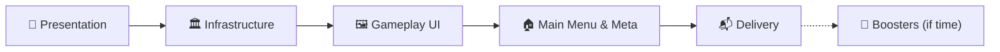

<div align="center">

# 🎬 ProductionV2

**The production plan for the vertical slice — the verified logic gets a face, an infrastructure, its screens and its meta**


<sub>[README](../../README.md) · [ProductionV1](ProductionV1.md) · [Level Format](LevelFormat.md) · [Extending](Extending.md) · [FINDINGS (prototype)](../prototype/FINDINGS.md) · [Case brief](../Game%20Developer%20Case%202026.pdf)</sub>

</div>

> [!IMPORTANT]
> **V2 goal:** The case brief's vertical slice: a playable level flow (Home → Gameplay → Win / Fail), five levels made with the Level Editor, coins and progress that survive a restart, delivered as an APK and a video.
> **Architecture goal:** Data, logic and view stay apart. The verified V1 core is **not rewritten**: presentation sits on top of it through one observer seam, and every asset, scene and config is loaded by key through Addressables, built so that remote content needs a profile change, not a code change.

| # | Section | What is in it |
|---|---|---|
| 1 | [📋 Scope](#-1-scope) | What the brief requires, what is optional, what stays out |
| 2 | [🗺️ Roadmap](#-2-roadmap) | Five stages and why in this order |
| 3 | [🎨 Presentation](#-3-presentation) | Layers, observer seam, director & sequencer, board, blocks, drag, exit, camera |
| 4 | [🏛️ Infrastructure](#-4-infrastructure) | Scopes, scenes, Addressables, asset lifetime, config, async |
| 5 | [🖼️ Gameplay UI](#-5-gameplay-ui) | HUD, pause, win and fail popups |
| 6 | [🏠 Main Menu & Meta](#-6-main-menu--meta) | Home, settings, coins, save, progression |
| 7 | [🚀 Boosters (if time)](#-7-boosters-if-time) | FreezeTime, Hammer |
| 8 | [⚡ Performance](#-8-performance) | Budget, allocation rules, how it is measured |
| 9 | [📦 Assemblies & Tests](#-9-assemblies--tests) | New assemblies and what tests them |
| 10 | [📬 Deliverables](#-10-deliverables) | README, APK, video |
| 11 | [🪜 Phase Plan](#-11-phase-plan) | Every phase with sub-steps and the test that ends it |
| 12 | [⏳ Time Budget](#-12-time-budget) | Day plan and the cut list |
| 13 | [❓ Open Questions](#-13-open-questions) | Settled when the phase that needs them starts |
| 14 | [📝 Decision Log](#-14-decision-log) | V2 decisions, numbered after V1 (D61+) |

---

## 📋 1. Scope

### Required by the brief
| Brief | Requirement | Acceptance criteria | Phase |
|---|---|---|---|
| 4.1 | **Home:** tab bar (placeholders), level button, top UI, settings button | Level button starts the current level · settings opens settings · layout correct at 1080×1920 and on 20:9 | M2, M4, U0 |
| 4.2 | **Settings:** placeholder buttons with feedback; vibration, sound, music toggles | Each toggle shows on / off · the screen closes back to Home | M3 |
| 4.3 | **Gameplay:** first 5 levels, timer, coins, fail popup, pause, restart, home. Boosters and lives may be placeholders | Complete a level and go to the next · timer stops the level at 0 · fail popup offers restart and home · restart leaves nothing from the last attempt · coins stay correct after leaving and returning | P1–P9, U1–U3, M0–M1, M4 |
| 4.4 | **Level editor:** width, height, doors, blocks, timer; visual; one format the game reads | A designer makes, saves and **plays** a level without code or hand-edited files · the 5 levels come from the editor | ✅ V1, P9, I5 |

### Optional (brief §5)
- **Ice blocker, Arrow block:** logic done in V1; views in P2.
- **Functional boosters:** FreezeTime and Hammer, only after every required item (§7).
- **Unsolvable-level warning (solver):** out of V2.

### Out of V2
- Other Home tabs, a working life system, shop, real downloads (no server: §4.4), new mechanics.

### Evaluation order (brief §6), and what answers it
1. **Architecture** — V1 core untouched; one observer seam; DI scopes; Addressables by key.
2. **Editor usability** — V1 + 12b; "Play" from the editor (P9, I5).
3. **Code quality** — production rules, small classes, no dead code.
4. **Correctness** — every acceptance criterion above maps to a phase and a test or a manual check.
5. **Performance** — no allocation in the update loop, measured draw calls (§8).
6. **Scope control** — the cut list (§12) protects the required items.

---

## 🗺️ 2. Roadmap



| Stage | Ends with | Why here |
|---|---|---|
| 🎨 **Presentation** | The game is fully playable and polished in one scene: board, blocks, drag, exit, Ice / Arrow, camera fit, five levels | The slice's core; once loaded, gameplay does not change with the infrastructure (D61) |
| 🏛️ **Infrastructure** | Bootstrap → Gameplay through VContainer scopes, Addressables, config, asset lifetime | Presentation is built refactor-ready, so this swaps wiring and loading only |
| 🖼️ **Gameplay UI** | HUD, pause, win / fail popups driven by the director | Uses the infrastructure's popup and scene services |
| 🏠 **Main Menu & Meta** | Home, settings, coins, save, progression, Home ↔ Gameplay | Small once save, config and scenes exist |
| 📬 **Delivery** | README per brief, APK, video | Android build tried early (I6), finished last |

**Refactor-ready presentation (D62):** views never know how they were loaded. They receive dependencies through `Initialize(...)` from one installer; assets come through one door (`PresentationAssets`); the level comes through Core's `ILevelSource`. In Infrastructure, the installer becomes a `LifetimeScope`, the door loads from Addressables, and the level source reads Addressables; views do not change.

---

## 🎨 3. Presentation

### Layers
```
Core (V1, untouched rules)          LevelSession ── ISessionObserver ──┐
                                                                       ▼
Runtime                       GameplayDirector  (decides what plays, owns flow & input lock)
                                    │ enqueues
                                    ▼
                              Sequencer ── steps (tween, wait, popup, camera…), awaitable, cancellable
                                    │ drives
                                    ▼
                              Views  (BoardView, BlockView, modifier views, effects)
Input ── DragController ── LevelSession.TryMove / CommitMove   (logic first, view follows)
```

### Observer seam (Core, D68)
- Core gains one interface, `ISessionObserver`, set on the session. The session calls it explicitly, like the dispatcher: no C# events, no bus (V1 D32 still holds).
- Calls: entity moved (entity, offset) · block exited (block, direction) · modifier added (entity, modifier) · modifier removed (entity, modifier) · state changed (Won / Failed / Playing).
- **Where each call comes from** (every path that changes what the view shows, D85):

| Call | Raised from |
|---|---|
| Entity moved | `LevelSession.TryMove` after a `Moved` step · `LevelCommands` applying `MoveEntity` (a listener can move walls and doors too, so it is an entity, not a block) |
| Block exited | `LevelSession.TryMove` after an `Exited` step, **before** the Exited event is dispatched, so the view hears the exit before its consequences |
| Modifier added / removed | `LevelCommands` applying `AddModifier` / `RemoveModifier` (Ice melting reaches it through `Durability.WearDown` → `RemoveModifier`) |
| State changed | One private `SetState` in `LevelSession`, used by win (`CheckWin`), fail (timeout, `Fail()` from a listener), continue (`AddTime`: Failed → Playing) and `Restart` |

- **Order inside one call:** the logic step completes, then the observer is told; commands flushed after an event report their own changes in flush order. The view therefore receives a move, the exit, then the modifier changes and finally the state change.
- `Restart` reports Playing; views rebuild from the board, not from replayed calls.
- `AddTime` from a listener changes no view directly; the HUD reads `RemainingTime`.
- A null observer is the default; Core tests do not need one.
- **The logic finishes first.** Exit and win happen in the logic immediately; the view is told and plays them later (FINDINGS: "logic finishes before the visual").

### Director & sequencer (D69)
- **Step:** one unit of presentation with `UniTask Play(CancellationToken)`. A tween, a delay, a popup, a camera move: everything is a step.
- **Sequencer:** plays steps in order; a group plays steps in parallel and waits for all. Pure C# over UniTask, tested with fake steps.
- **Director:** turns observer calls into steps and owns the flow:
  - An exit enqueues the block's exit step; other blocks stay playable (non-blocking).
  - **Win:** lock input → wait for the last exit step → short delay → win popup.
  - **Fail:** lock input → let running exit steps finish → fail popup.
- **Cancel:** restart and home cancel the whole sequence through one token; no half tween or popup survives; views are rebuilt from level data.
- **Input lock** is the director's flag; the drag controller reads it.

### Board view
- **Ground:** one GroundGrid tile per playable cell, cell pitch 2 units (FINDINGS).
- **Frame and doors:** production walls and doors are **cells**; the art's walls sit on **cell edges**. Settled by D93, D98 and D99:
  - **Walls (quadrant rule):** every wall or door cell is split into four 1×1 quadrants, and each quadrant looks at its two side neighbors and its diagonal: both sides open → outer `Corner`, one side open → `Wall` facing it, only the diagonal open → inner `Corner`, nothing open → empty. Frame, inner walls and notches follow from the one rule; a lone inner wall becomes a round pillar of 4 corners. Every piece is one `WallPiece` with its mesh swapped to `Wall` or `Corner`.
  - **Doors:** one `DoorPiece` per run of same-color, same-direction door cells, on the approach side, stretched to the run's length; its arrow stays at the run's center (D98).
- **Prefabs (D99):** the kit's prefabs only (`GroundTile`, `BlockPiece`, `ArrowPiece`, `WallPiece`, `DoorPiece`). Variety comes from mesh / material swap and run length, always through a View component on the prefab root with serialized references; code never finds a child by path.
- **Palette:** a palette asset holds the colors; one shared block and one shared door material per color are made from them at load (D74, D95). The editor's preview colors and the "colorId exists in the palette" rule (V1 D52) switch to it.

### Block view
- **BlockDrawRule** (FINDINGS shape): block cells → list of (piece, local position, rotation). Pure C#, rewritten from the prototype's knowledge, tested on L, T, U, ring and plus shapes.
- **Pieces** come from a pool; restart returns them.
- **Ice view:** frozen overlay with the remaining count; updates on each exit; melts (step) when the modifier is removed.
- **Arrow view:** fitted arrow on the run through the block's most central cell, `min(run, 3)` (FINDINGS).
- **Modifier → look (D104):** a pure C# presenter per modifier reads the logic and drives a dumb view; `ModifierPresenters.Default()` picks the presenter, so a new modifier's look is a new presenter + view and one line there (V1 additive criterion carried into presentation).

### Input & drag (FINDINGS rules)
- Pointer → ray onto the ground plane → `floor(local / 2)` → cell. No colliders.
- Free 2D drag: the logic moves toward the pointer cell by cell (larger axis first, other axis if blocked); the visual follows the pointer, clamped to reachable space: at most half a cell off its cell, never toward a refused cell.
- Release snaps to the nearest reachable cell, then `CommitMove()`.
- A block that exits mid-drag ends the move.
- The pure parts (pointer → cell, walk planning) are tested without a scene.

### Exit visual
- Snap to the door → slide through it → disabled; cut by a world clip plane in a production block shader (`Cull Off`, flat cap shade) (FINDINGS).
- Per-row particles, pooled; property blocks cached; no per-call allocation (FINDINGS cost).
- SFX: select, drop, crunch through one audio service.

### Camera fitting (D73)
- Same camera setup as the prototype.
- Fit = board bounds + margins for the HUD (top / bottom) inside the safe area → camera distance / size, for aspects from 16:9 to 20:9. Pure function, tested with numbers.

### Time & pause (D70)
- A tick adapter calls `session.Tick(dt)`. Pause stops forwarding ticks and locks input; `Time.timeScale` is not touched, so UI animations keep running.

### Restart (D71)
- The session restarts from its `LevelData` (V1). Views return to pools and are rebuilt; the sequence is cancelled. Nothing from the last attempt stays: the brief's acceptance criterion, also on the view side.

---

## 🏛️ 4. Infrastructure

> [!NOTE]
> How groups, keys, labels, loading and release work in practice, and what is built so far: [`Addressables.md`](Addressables.md).

### Scopes & scenes (D63, D64)
| Scene | In Build Settings | Scope | Holds |
|---|---|---|---|
| **Bootstrap** | ✅ the only one | Root `LifetimeScope` (lives for the whole run) | Asset loader, scene loader, save, config, audio, wallet, progression |
| **Main** | ❌ Addressable | `MainLifetimeScope` (child of root) | Home, settings |
| **Gameplay** | ❌ Addressable | `GameplayLifetimeScope` (child of root) | Session, director, views, HUD, popups |

- Scenes are minimal: they carry their `LifetimeScope` and hand-made layout; content that depends on data (board, blocks, popups) is created from code.
- Scene changes go through `ISceneLoader` only; nobody calls `SceneManager` or `Addressables.LoadSceneAsync` directly.

### Bootstrapper flow
1. Initialize Addressables.
2. Content update check (§4.4): catalog → download size → download (all no-ops locally).
3. Load config and save.
4. Open Main, or Gameplay when the editor asked to play a level (I5).

### Asset lifetime (D66)
- `IAssetLoader` is the only door to Addressables. Every handle is registered in an **asset scope** owned by a `LifetimeScope`.
- Disposing a scope releases every handle it holds. Scene unload disposes its scope.
- **Tracking:** each scope counts open handles; in development builds and in tests, a scope that closes with handles still open logs them. Bundle reference counts are checked with the Addressables Event Viewer at the end of I6.
- No `Resources`, no direct asset references in scenes for data-driven content.

### Addressables without a server (D65)
- Everything is reached **by key**: level JSONs (key = level key, V1 D52), prefabs, palette, config, popups, scenes.
- Two profiles: **Local** (used) and **Remote** (defined, load path empty). Switching to a server is a profile change.
- The download flow exists and runs: `InitializeAsync` → `CheckForCatalogUpdates` → `GetDownloadSizeAsync` (0 locally) → `DownloadDependenciesAsync` (nothing to fetch). It is the path a server build would take.
- Groups by lifetime: `Boot` (config, palette), `Main`, `Gameplay`, `Levels`, `Popups`.

### Async boundary (D67)
- Core takes no package dependency: `ILevelSource` keeps returning `Task<Result<LevelData>>`.
- Runtime and Infrastructure use UniTask; Core tasks are awaited as UniTask at the edge.
- UniTask arrives in P0 (the sequencer needs it); VContainer and Addressables in I0.

### Config (D72)
- `GameConfig` (Addressable, `Boot` group): ordered level keys, coin reward per win, popup delays.
- Values that are not data stay out of code (brief: "not a plain number").

### Editor "Play" (D75)
- The Level Editor gets a **Play** button: it saves (if valid), stores the level key in `SessionState`, and enters play mode from the Bootstrap scene.
- The bootstrapper sees the key and opens Gameplay with that level; normal play ignores it.
- Before Infrastructure (P9), Play opens the Gameplay scene directly with the key; I5 moves it behind the bootstrapper.

---

## 🖼️ 5. Gameplay UI
- **Canvas:** uGUI, `CanvasScaler` reference 1080×1920, match tuned for 20:9; a `SafeArea` component on every screen root (D76).
- **HUD:** remaining time, level number, coins (M1), pause, restart.
- **Popups:** a popup service loads popup prefabs through the gameplay asset scope and plays their open / close as sequencer steps.
- **Pause popup:** resume, restart (home added in M4).
- **Win popup:** coins earned (M1), next level.
- **Fail popup:** restart, home (home wired in M4; until then restart only).
- Every button gives visual feedback (brief): one shared button feedback component.

---

## 🏠 6. Main Menu & Meta

### Meta logic (pure C#, D77)
- **Progression:** current level index over the config's key list; after the last level it **wraps to the first** (D78).
- **Wallet:** coin balance; a win adds the reward from config (D79).
- **Settings:** vibration, sound, music flags.
- All three live in a pure C# assembly (`Game.Meta`) and are tested without Unity.

### Save
- `ISaveStorage` (Meta) → JSON in `persistentDataPath` (Infrastructure). Saved on change and on pause / quit.
- Brief criterion "coins stay correct after leaving and returning" is a test on wallet + storage.

### Screens
- **Home:** tab bar (placeholder tabs with feedback), top UI (coins, lives placeholder, settings), level button showing the current level.
- **Settings:** three toggles with distinct on / off states, placeholder buttons with feedback, close back to Home.
- **Navigation:** Home → Gameplay (level button), Gameplay → Home (fail popup, pause popup), Win → next level.

---

## 🚀 7. Boosters (if time)
Only after Delivery is secured (D80).
- **FreezeTime:** stops ticks for N seconds (config); a view and a HUD button.
- **Hammer:** removes a chosen block. Needs a logic decision: removal through a new session operation, counted as an exit or not (open question when it starts).
- Both cost coins from the wallet.

---

## ⚡ 8. Performance
- **Mode:** production rules (`.claude/rules/production/allocation.md`): no LINQ, closures, boxing or per-frame `new` on hot paths.
- **Hot paths:** drag (every pointer move), tick, sequencer step scheduling, exit particles.
- **Pools:** block pieces, exit particles, popups per scope.
- **Draw calls:** one shared material per palette color; GPU instancing on block and ground materials where the shader allows; the exit clip uses a cached property block only while a block exits (FINDINGS cost).
- **Evidence, not claims:** Frame Debugger batch count and a Profiler GC Alloc capture during a drag, before and after P8, recorded as a table in P8. A mid-range Android check in I6 / Delivery.

### Measurements (P8)
Recorded in [`Performance.md`](Performance.md): draw calls 183 → 15, no allocation per frame, and the small per-action garbage accepted on purpose with its known fixes (D108, D109).

---

## 📦 9. Assemblies & Tests

| Assembly | Contents | References |
|---|---|---|
| `Game.Core` (V1) | Logic + `ISessionObserver` seam | — |
| `Game.LevelIO` (V1) | JSON | Core, Newtonsoft |
| `Game.Meta` | Progression, wallet, settings, save model, `ISaveStorage`. **No UnityEngine** | — |
| `Game.Runtime` | Presentation (director, sequencer, views, input, camera), UI, scopes | Core, LevelIO, Meta, Infrastructure, UniTask, DOTween, VContainer |
| `Game.Infrastructure` | Asset loader & scopes, scene loader, Addressables flow, save storage, config loading | Core, LevelIO, Meta, UniTask, VContainer, Addressables |
| `Game.LevelEditor` (V1) | Editor; gains Play (P9, I5) | Core, LevelIO |
| `Game.Tests.Meta` | Meta tests | Meta |
| `Game.Tests.Runtime` | EditMode tests of Runtime's pure parts (sequencer, draw rule, camera fit, drag resolver) | Runtime |
| `Game.Tests.Infrastructure` | Asset scope tracking with a fake loader | Infrastructure |
| `Game.Tests.PlayMode` | Only where the Unity runtime is required (scene flow smoke test) | Runtime |

- V1 rules hold: Core and Meta never see UnityEngine; fakes over mocks; every phase ends with a named test.
- Folder depth stops at 2 under an assembly root (code-shape rule); a crowded assembly splits.
- Packages added in V2: UniTask (P0), VContainer and Addressables (I0).

---

## 📬 10. Deliverables
| Item | Content | Phase |
|---|---|---|
| **README** | How to open and run · how to open the editor and make a level · architecture decisions and reasons · known problems · LLM tools and what they were used for · approximate work time | R1 |
| **APK** | Android build, Addressables built first | I6 (smoke), R2 |
| **Video** | ≤ 3 min, full flow: Home → level → win → next → fail → restart → home → settings | R2 |
| **Asset feedback** | Problems found in the supplied assets (FINDINGS: mesh-level fixes, wall run stretching) | R1 |

---

## 🪜 11. Phase Plan
One phase per answer, following the production process. **Files touched** are decided when each phase starts. A visual phase ends with its pure-C# test plus a stated check in the Editor.

### 🎨 Stage A: Presentation
| # | Phase | Sub-steps | Done when | Status |
|---|---|---|---|---|
| P0 | Runtime Skeleton | P0.1 UniTask package · P0.2 `Game.Runtime` + `Game.Tests.Runtime` asmdefs · P0.3 `ISessionObserver` in Core, called by the session · P0.4 Gameplay scene + manual `GameplayInstaller` + `TextAsset` level source | `Session_TellsTheObserver_MovesExitsRemovalsAndState` | ✅ |
| P1 | Board View | P1.1 palette asset + one material per color · P1.2 ground tiles for playable cells · P1.3 frame and doors (D93, D98, D99) · P1.4 inner walls | `WallDrawRule_DressesFrameInnerWallsAndDoors` + level visible in the Editor | ✅ |
| P2 | Block View | P2.1 `BlockDrawRule` (pure) · P2.2 pooled pieces (`BlockPiece` / `ArrowPiece` + `PieceView` mesh swap, D99) · P2.3 Arrow view · P2.4 Ice view with count · P2.5 modifier → view asset mapping | `BlockDrawRule_DressesLTURingAndPlus` | ✅ |
| P3 | Camera Fit | P3.1 fit function (bounds, HUD margins, safe area, aspect) · P3.2 camera applies it on level load | `CameraFit_KeepsTheBoardInside_From16x9To20x9` | ✅ |
| P4 | Input & Drag | P4.1 pointer → cell (`BoardRaycast`) · P4.2 drag resolver (move toward the pointer) · P4.3 clamp to reachable, snap, `CommitMove` · P4.4 exit mid-drag ends the move | `DragResolver_MovesTowardThePointer_LargerAxisFirst` | ✅ |
| P5 | Director & Sequencer | P5.1 step contract + sequencer (order, parallel, cancel) · P5.2 director: exit steps non-blocking · P5.3 input lock · P5.4 win / fail sequences (popup placeholder step) | `Sequencer_PlaysInOrder_GroupsInParallel_AndCancels` | ✅ |
| P6 | Exit Visual & Feedback | P6.1 production block shader with clip plane · P6.2 exit step (snap, slide, cut) · P6.3 pooled row particles · P6.4 SFX service | `ExitStep_CompletesAndDisablesTheBlock` (step with a fake view) + exit seen in the Editor | ✅ |
| P7 | Restart & Lifecycle | P7.1 cancel sequence, return pools, rebuild · P7.2 tick adapter, pause stops ticks | `Restart_LeavesNoViewOrStepFromTheLastAttempt` | ✅ |
| P8 | Polish & Performance | P8.1 feel pass (tuning from FINDINGS) · P8.2 draw call pass (shared materials, instancing) · P8.3 GC Alloc pass on drag / tick · P8.4 measurement table | Measurement table recorded (batches, GC Alloc per frame) | ✅ |
| P9 | Five Levels & Editor Play | P9.1 Play button (save → open Gameplay with the key) · P9.2 build levels 1–5 in the editor · P9.3 palette rule in the editor | `PlayRequest_StoresTheLevelKey_ForTheGame` + five levels played | ✅ |

### 🏛️ Stage B: Infrastructure
| # | Phase | Sub-steps | Done when | Status |
|---|---|---|---|---|
| I0 | Packages & Root Scope | I0.1 VContainer, Addressables · I0.2 `Game.Infrastructure`, `Game.Meta` + test asmdefs · I0.3 Bootstrap scene + root `LifetimeScope` | `RootScope_ResolvesItsServices` | ✅ |
| I1 | Asset Loader & Scopes | I1.1 `IAssetLoader` over Addressables · I1.2 asset scope: register, release on dispose, open-handle count · I1.3 leak log in development | `AssetScope_ReleasesEveryHandle_OnDispose` | ✅ |
| I2 | Scene Loader | I2.1 `ISceneLoader` over Addressables scenes · I2.2 child scopes for Main / Gameplay · I2.3 scene unload disposes its scope | `SceneFlow_BootstrapToGameplay_AndBack` (PlayMode smoke) | ✅ |
| I3 | Addressables Setup | I3.1 groups and keys · I3.2 Local / Remote profiles · I3.3 content update flow (init → catalog → size → download) | `ContentUpdate_RunsEveryStep_WithNothingToDownload` | ✅ |
| I4 | Config & Level Source | I4.1 `GameConfig` · I4.2 Addressables level source · I4.3 `GameplayInstaller` → `GameplayLifetimeScope`; `PresentationAssets` from Addressables | `LevelSource_LoadsByKey_AndRejectsAnUnknownKey` | ✅ |
| I5 | Editor Play via Bootstrap | I5.1 Play enters play mode from Bootstrap · I5.2 bootstrapper honours the stored key | `Bootstrapper_OpensTheRequestedLevel_WhenOneIsStored` | ✅ |
| I6 | Release Check & Android Smoke | I6.1 Event Viewer: no bundle left after Gameplay → Bootstrap · I6.2 first APK on a device | Zero open handles after a full scene round trip + APK runs | ✅ |

### 🖼️ Stage C: Gameplay UI
| # | Phase | Sub-steps | Done when | Status |
|---|---|---|---|---|
| U0 | Canvas & Safe Area | U0.1 canvas setup 1080×1920 · U0.2 `SafeArea` · U0.3 shared button feedback · U0.4 loading cover over every content scene change, lifted when the scene is ready (D119) | `SafeArea_FitsTheRect_ForA20x9Notch` | ⏳ |
| U1 | HUD | U1.1 timer, level number · U1.2 pause and restart buttons | `TimerText_ShowsMinutesAndSeconds_AndStopsAtZero` | ⏳ |
| U2 | Popup Service & Pause | U2.1 popup service (scope-owned, open / close as steps) · U2.2 pause popup: resume, restart | `PopupService_ReleasesThePopup_WhenItsScopeCloses` | ⏳ |
| U3 | Win & Fail | U3.1 win popup → next level · U3.2 fail popup → restart (home in M4) · U3.3 director sequences use them | `Director_ShowsWin_AfterTheLastExitStep` | ⏳ |

### 🏠 Stage D: Main Menu & Meta
| # | Phase | Sub-steps | Done when | Status |
|---|---|---|---|---|
| M0 | Save & Progression | M0.1 save model + `ISaveStorage` + JSON storage · M0.2 progression with wrap | `Progression_WrapsToTheFirstLevel_AfterTheLast` | ⏳ |
| M1 | Wallet | M1.1 wallet + reward from config · M1.2 coins in HUD and win popup | `Coins_StayCorrect_AfterLeavingAndReturning` | ⏳ |
| M2 | Home | M2.1 tab bar placeholders · M2.2 top UI · M2.3 level button | `LevelButton_ShowsAndStartsTheCurrentLevel` | ⏳ |
| M3 | Settings | M3.1 toggles saved, distinct on / off · M3.2 placeholder buttons · M3.3 close to Home | `SettingsToggles_PersistAcrossARestart` | ⏳ |
| M4 | Navigation | M4.1 Home → Gameplay · M4.2 fail / pause → Home · M4.3 win → next level | `SceneFlow_HomeLevelWinNextFailHome` (PlayMode smoke) | ⏳ |

### 📬 Stage E: Delivery
| # | Phase | Sub-steps | Done when | Status |
|---|---|---|---|---|
| R1 | README | R1.1 every brief §7 item · R1.2 asset feedback · R1.3 known problems | Every brief §7 point present | ⏳ |
| R2 | APK & Video | R2.1 Addressables + Android build · R2.2 full-flow recording ≤ 3 min | APK installed and played; video uploaded | ⏳ |

### 🚀 Stage F: Boosters (if time)
| # | Phase | Sub-steps | Done when | Status |
|---|---|---|---|---|
| B1 | FreezeTime | B1.1 tick pause for N s · B1.2 HUD button + cost | `FreezeTime_StopsTheTimer_ForItsDuration` | ⏳ |
| B2 | Hammer | B2.1 logic decision (open question) · B2.2 pick a block · B2.3 cost | `Hammer_RemovesTheChosenBlock` | ⏳ |

---

## ⏳ 12. Time Budget
~45 hours over 3 days (D81).

| Day | Stages | Estimate |
|---|---|---|
| 1 | 🎨 Presentation P0–P9 | 14–15 h |
| 2 | 🏛️ Infrastructure I0–I6 · 🖼️ U0–U1 | 14–15 h |
| 3 | 🖼️ U2–U3 · 🏠 M0–M4 · 📬 R1–R2 | 14–15 h |

**Cut list, first to go:**
1. 🚀 Boosters.
2. P8.1 feel pass beyond FINDINGS values.
3. I3.3 content update flow reduced to `InitializeAsync` + the Remote profile only.
4. PlayMode smoke tests replaced by a scripted manual check in the README.

The brief's acceptance criteria (§1) are never cut.

---

## ❓ 13. Open Questions

| # | Question | Needed by | Answer |
|---|---|---|---|
| Q1 | **Frame cells vs. edge art.** Walls and doors are cells in production, but the kit's walls sit on cell edges. How is the frame drawn? | P1 | ✅ D86 |
| Q2 | Does the board view read the `Board` directly, or a view model built once from `LevelData`? | P1 | ✅ D87 |
| Q3 | Ice view: count shown as text or as cracks per stage? | P2 | ✅ D88 |
| Q4 | Win popup timing: fixed delay after the last exit, or after the exit particles end? | P5 | ✅ D89 |
| Q5 | Is `Game.Runtime` one assembly with UI inside, or UI separate? | P0 | ✅ D90 |
| Q6 | Hammer: is a hammered block an exit (counts for Ice, listeners) or a removal? | B2 | Open; decided when B2 starts |

---

## 📝 14. Decision Log
V1 decisions (D1–D60) still hold; see [ProductionV1 §16](ProductionV1.md#-16-decision-log).

| # | Topic | Decision |
|---|---|---|
| D61 | Stage order | Presentation → Infrastructure → Gameplay UI → Main Menu & Meta → Delivery. Boosters only if time |
| D62 | Refactor-ready presentation | Views know nothing about loading: `Initialize(...)` from one installer, assets through one door (`PresentationAssets`), the level through `ILevelSource`. Infrastructure swaps the installer for a `LifetimeScope` and the door for Addressables |
| D63 | Scenes | Minimal scenes that carry a `LifetimeScope` and hand-made layout; data-driven content is created from code. Only Bootstrap is in Build Settings |
| D64 | DI | VContainer. Root scope in Bootstrap for the whole run; Main and Gameplay are child scopes. A `LifetimeScope` is the composition root (replaces V1's manual `GameInstaller` rule) |
| D65 | Addressables | Every asset, scene, config and level by key. Local profile used; Remote profile defined for a future server; the content update flow runs and finds nothing to download. No `Resources` |
| D66 | Asset lifetime | One `IAssetLoader`; every handle belongs to an asset scope owned by a `LifetimeScope`; disposing releases all; open handles are counted and logged in development and tests |
| D67 | Async boundary | Core takes no package: `ILevelSource` stays `Task<Result<LevelData>>`. Runtime and Infrastructure use UniTask (added in P0) |
| D68 | Logic → view | One Core seam, `ISessionObserver`, called explicitly by the session (moved, exited, modifier removed, state changed). No C# events, no bus; null observer by default |
| D69 | Director & sequencer | Presentation runs through a director that turns observer calls into steps and a sequencer that plays them in order or in parallel groups, awaitable and cancellable. Win / fail wait for their steps; restart and home cancel everything with one token |
| D70 | Pause | Stops forwarding ticks and locks input; `Time.timeScale` is not used |
| D71 | Restart | Session restarts from `LevelData`; views go back to pools and are rebuilt; the sequence is cancelled |
| D72 | Config | `GameConfig` Addressable: level keys in order, coin reward, presentation delays. Tunable values are data, not literals |
| D73 | Camera | Prototype camera kept; a fit function places the board inside the safe area with HUD margins, 16:9 to 20:9 |
| D74 | Materials | One shared material per palette color; colors come from the palette asset, never `new Material` per block — for blocks superseded by D108 |
| D75 | Editor Play | Level Editor Play saves, stores the key in `SessionState` and enters play mode; from I5 always through the bootstrapper |
| D76 | UI | uGUI, `CanvasScaler` 1080×1920, `SafeArea` on every screen root, one shared button feedback |
| D77 | Meta | Progression, wallet and settings are pure C# in `Game.Meta`; storage behind `ISaveStorage`, JSON in `persistentDataPath` |
| D78 | Progression | After the last level the game wraps to the first |
| D79 | Coins | A win adds a fixed reward read from config |
| D80 | Boosters | FreezeTime and Hammer, only after Delivery is secured |
| D81 | Budget | Three days, ~45 hours; the cut list protects the brief's acceptance criteria |
| D82 | Messaging | No message bus library; services are injected. Revisited only if a real need appears |
| D83 | Deliverables | Both an APK and a video; the Android build is tried in I6, before the last day |
| D84 | Tweens | DOTween stays for production tweens, awaited through UniTask's DOTween support |
| D85 | Observer call points | `ISessionObserver` also hears modifier added and entity moved (not only blocks). Calls come from `LevelSession` (moves, exits, one `SetState` for every state change incl. continue and restart) and `LevelCommands` (command moves, modifier add / remove). The exit is reported before its event is dispatched |
| D86 | Frame drawing (Q1) | ~~The frame ring is drawn as the prototype's thin border on the edge between a frame cell and a playable cell; same-color door cells in a line become one door run; inner wall cells use full wall pieces~~ — superseded by D93 and D94 |
| D87 | Board view source (Q2) | Views read `Board` read-only for positions; static layout (frame, ground) is built once from `LevelData` |
| D88 | Ice view (Q3) | Remaining count as text; crack stages only if time |
| D89 | Win popup timing (Q4) | After the last exit step finishes, plus a delay from config |
| D90 | Runtime assembly (Q5) | `Game.Runtime` is one assembly with UI inside; split only when a folder would pass depth 2 |
| D91 | `Resources` exception | `Assets/Resources/DOTweenSettings.asset` stays: DOTween requires it. It is the only `Resources` use; game content never goes there (D65) |
| D92 | Case brief | `docs/Game Developer Case 2026.pdf` is kept locally and ignored by git |
| D93 | Wall drawing | Quadrant rule over solid cells (walls and doors): both sides open → outer `Corner`, one side open → `Wall` facing it, only the diagonal open → inner `Corner`, else nothing. One rule for frame, inner walls and notches; each piece is a 1×1 `WallPiece` with the `Wall` or `Corner` mesh. Known gap: the middle of a 2×2 or larger inner wall block stays empty, the kit has no fill piece |
| D94 | Door drawing | ~~One door piece per door cell on its approach side, no stretching; one arrow per run of door cells with the same color and direction, across door entities. The kit's `DoorPiece` is split into `DoorCell` and `DoorArrow` prefabs~~ — superseded by D98 |
| D95 | Palette materials | The palette asset holds colors only. `PaletteMaterials` makes one block and one door material per color from the kit's template materials at load, shares them, and destroys them when its owner closes |
| D96 | P1 test | `WallDrawRule_DressesFrameInnerWallsAndDoors` replaces `FrameRuns_GroupDoorsAndWalls_ByEdge` |
| D97 | Asset folders | Materials live under `Assets/Art/Materials/`, shaders under `Assets/Art/Shaders/`. ScriptableObject assets live under `Assets/ScriptableObjects/`, grouped in concept subfolders (`Presentation/`: palette, presentation assets) |
| D98 | Door drawing | One `DoorPiece` per run of door cells with the same color and direction (across door entities), on the run's approach side; the door mesh is stretched to the run's length, the arrow stays unscaled at the center (prototype method) |
| D99 | Prefabs & views | Only the kit's prefabs (`GroundTile`, `BlockPiece`, `ArrowPiece`, `WallPiece`, `DoorPiece`); no prefab per piece kind. Variety comes from mesh / material swap and run length, through a View component on the prefab root (`PieceView`, `DoorPieceView`) whose references are serialized; code never finds a child by path. Meshes are referenced from `PresentationAssets` |
| D100 | Folder size | A code folder holds at most 6 files; the change that adds the 7th splits it into concept subfolders, the root keeping the central types. Checked at the end of every phase (`code-shape.md` § Folders). Applied in P1 to `Runtime/Board` (`Drawing/`), `Core/Session` (`Win/`) and its tests |
| D101 | Modifier → view | ~~A `ModifierViews` asset lists `ModifierView` prefabs. Each view says which modifier it draws (`Accepts`, a type check in its own class); the first that accepts draws it, none means no look. A new modifier's look is a new view class and one list entry; no reflection, no Core change~~ — superseded by D104 |
| D102 | Ice view | The frozen block's parts switch to one shared ice material (`Art/Materials/Ice.mat`, shader `Game/IceBlock`: lit and opaque so studs keep their shading, two fixed ice colors blended by the ice texture projected triplanar in world space, crack detail and a view rim); the remaining count is 3D text on the block's anchor cell |
| D103 | Arrow view | ~~The kit's arrow is single-headed and points the Arrow modifier's direction~~ — corrected by D105; `ArrowView` sits on `ArrowPiece` and swaps `Arrow_1/2/3` by run length (`min(run, 3)`). A serialized yaw offset fixes the mesh's own orientation |
| D104 | View / presenter | Views are dumb MonoBehaviours with no `Game.Core` reference (`IceView.SetCount`, `ArrowView.Show`). A pure C# presenter per modifier (`IcePresenter`, `ArrowPresenter`) reads the logic (casts, `Durability`, placement rules) and drives its view; `ModifierPresenters.Default()` picks the first presenter that accepts a modifier. A new modifier's look adds a presenter, a view, one line in `Default()` and one field in `ModifierViews`. `BlockView` no longer exposes the `Block`. Rule in `architecture.md` § View / Presenter |
| D105 | Arrow = axis lock | Arrow locks a block to an axis, `Horizontal` or `Vertical`, both ways (prototype behaviour); supersedes V1 D18 (one direction). Core gains `Axis` and `Direction.ToAxis()`; `Arrow.Allows` converts the move's direction to its axis. Saved as `"axis"`, a new field kind; `schemaVersion` 1 → 2, the levels re-saved by hand, no migration (LevelFormat §2 version history). The kit's `Arrow_N` is double-headed: laid along Z for Vertical, X for Horizontal. The drag keeps its previous-cell rule (`DragResolver.ClampToReachable` may offset back toward the cell the last move left) for future one-way mechanics |
| D106 | Drag naming | Names say what the code does, not a hand metaphor; input uses Unity Input System words. `IPointerInput` (`WasPressedThisFrame`, `IsPressed`, `PointerRay`), `MousePointerInput`, `BoardRaycast` (`TryGetCellPoint`, `ToCell`), `DragResolver` (`MoveToward`, `ClampToReachable`, `BeginDrag`), `DragController` (`TrySelectBlock`, `UpdateDrag`, `EndDrag`), `DragSettings` (`LiftHeight`, `SnapDuration`), `BlockView.SetPosition` / `SnapTo` |
| D107 | Move preview | Core decides every move, also the ones presentation only previews. `BlockMover.Preview` holds the move rule and `TryMove` applies its answer; `LevelSession.PreviewMove` exposes it without changing the board or telling the observer. `DragResolver.ClampToReachable` leans only where the preview says `Moved`; Runtime no longer combines `Capabilities` and `Board.CanPlace` itself. Board occupancy is still read for two view-only cases: the diagonal lean and the cell the last move left |
| D108 | Instanced drawing (P8.2) | Every block shares one instanced `Game/Block` material; its color is a per-instance property (`UNITY_DEFINE_INSTANCED_PROP _Color`) set through one reused `MaterialPropertyBlock`, so pieces of one mesh draw together whatever their color. Exit particles use the same material with their color set once. Doors keep one material per color. Walls and door arrows draw with instanced copies of the kit's FBX-embedded materials; `Ground`, `Arrow` and `Ice` materials and the `IceBlock` shader are instanced. Static batching was not used: runtime combining needs Read/Write meshes and instancing already covers the repeats. Known cost: an exiting block's clip plane is not per instance, so that block draws alone until it is gone. Supersedes D74 for blocks |
| D109 | Tween garbage | Measured on Android (IL2CPP): DOTween's `DOLocalMove` cost ~0.6 KB per release and ~0.7 KB per exit (new getter / setter closures and a new tween each call). `BlockView` moves through `DOTween.To` with a getter and setter made once per view, and marks its tweens recyclable; no tween reference is kept past its end, so a recycled tween is never touched again. Recycling stays per tween, not global |
| D110 | Editor Play & palette (P9) | The Level Editor's **▶ Play** saves (rules first), stores the key through `PlayRequest` in `SessionState`, opens the Gameplay scene and enters play mode. The installer takes the request once and reads that level straight from `Assets/Levels/<key>.json` (`EditorFileLevelSource`, Editor only), so a new level plays without being added to any list; without a request it plays its own level. `Game.LevelEditor` references `Game.Runtime` for the request and the palette. The editor's colors come from the palette asset, and `PaletteColorRule` closes V1's deferred "colorId exists in the palette" rule. I5 moves Play behind the bootstrapper |
| D111 | Early exit & selection | A block beside its door leans into it (the preview says `Exited`) and exits once the pointer pulls it `DragSettings.ExitThreshold` (0.3) of a cell toward the door, instead of at the half-cell where the pointer would round onto the door. Core still decides: the early exit only acts where `PreviewMove` says `Exited`. The held block gets the prototype's screen-space outline (`Game/SelectionOutline` through a camera command buffer, material in `PresentationAssets`), shown on select and hidden on release, exit and restart |
| D112 | Root scope (I0) | Packages: VContainer 1.19.0 (git tag), Addressables 1.29.0 (last 1.x, Unity 2021.3+). The root scope's registrations live in a pure `RootInstaller` (Infrastructure, VContainer `IInstaller`) so a test builds them without a scene; `RootLifetimeScope` (Runtime) only calls it. I0 registers `IContentInitializer` (Addressables `InitializeAsync`) and the `Bootstrapper` entry point; later services join as their phases arrive. `Game.Meta` and `Game.Tests.Meta` open in M0, when they get code, not as empty assemblies in I0 |
| D113 | Asset scope (I1) | `IAssetSource` is the raw Addressables door (a failed or cancelled load releases its own handle); `AssetScope : IAssetLoader` keeps every handle it loads and releases them all on `Dispose`. Registered `Lifetime.Scoped`, so each `LifetimeScope` owns one and VContainer disposes it with the scope. A **leak** is a handle that would outlive its scope: a load finishing after `Dispose` is released at once, logged as a warning in the Editor and development builds, and the caller sees a cancel. Assets are `UnityEngine.Object`; an unknown key throws (the level source turns it into a `Result` in I4) |
| D114 | Scene flow (I2) | Bootstrap stays loaded for the whole run and is the only scene in Build Settings; the root scope lives with it, no `DontDestroyOnLoad`. One content scene at a time is opened **additively** by `ISceneLoader` (`AddressablesSceneLoader`), made active so objects created from code land in it, and unloaded before the next opens. Its `LifetimeScope` gets the root as parent through `LifetimeScope.EnqueueParent`, so a scene played alone in the Editor runs without a parent (Level Editor Play keeps working until I5). Until M2 the bootstrapper opens Gameplay; `Main` and `MainLifetimeScope` arrive in M2 with their content. `GameplayLifetimeScope` registers nothing until I4 moves `GameplayInstaller`'s wiring into it |
| D115 | Addressables setup (I3) | Groups are made by hand once (checklist in `Addressables.md` §8) and created only when their first asset exists: `Gameplay` (the scene, Local, Pack Together) and `Levels` (`Level_1`–`Level_6`, Remote paths, **Pack Separately**, label `remote`) now; `Boot` in I4, `Main` in M2, `Popups` in U2. Groups use the profile's Local / Remote bundle locations; the **Default** profile (it cannot be renamed) sets Remote to `Built-In`, the **Remote** profile to `Custom` (`ServerData`, empty load path), so a server is a profile change only. Catalogs update only manually; a remote catalog is built. The start-up content update (`ContentUpdate` over `IContentDelivery`) checks catalogs, updates only changed ones, then cleans cached bundles the new catalogs no longer use (`CleanBundleCache` once `Caching.ready`; a failed cleaning only warns, since inside `UpdateCatalogs` it failed the whole update on Android), sizes and always runs the download of `remote` (nothing to fetch locally) |
| D116 | Config & level source (I4) | `GameConfig` (Infrastructure, Addressable `GameConfig` in the new `Boot` group) holds the level keys in play order (`Level_1`–`Level_5`; `Level_6` stays playable through the Level Editor only) and the win popup delay; coins join in M1. The root container is built before the config can load, so a root singleton `LoadedConfig` is set once by the bootstrapper (after the content update, before the first scene) and throws if read earlier. Levels come through `AssetLevelSource` (scoped, over the scope's `IAssetLoader`), an unknown key is a failed `Result`. Until M0 the game plays the first key. I4 is written in two steps: 4a config and level source, 4b `GameplayInstaller` → `GameplayLifetimeScope` and `PresentationAssets` from Addressables. Level Editor Play stops working after 4b until I5 moves it behind the bootstrapper |
| D117 | Gameplay scope (I4b) | `GameplayInstaller` is gone. `GameplayLifetimeScope` carries the scene's references and settings (camera rig, drag and exit settings) and runs `GameplayEntry` (`IAsyncStartable`, VContainer `ITickable`, `IDisposable`): it loads `PresentationAssets` (Addressable in the `Gameplay` group; its prefabs, meshes, materials and palette come as dependencies, so the palette stays out of `Boot`) and the level by key, then builds the session, views and play objects by hand, because they depend on loaded data. Everything it creates is parented under the scope's object, so it lives and dies with the scene whatever the active scene is. VContainer's tick replaces `FrameTicker`; `TextAssetLevelSource` is removed. `EditorFileLevelSource` stays for I5 |
| D118 | Editor Play via Bootstrap (I5) | Every Play in the Editor starts from the Bootstrap scene (`EditorSceneManager.playModeStartScene`, set by `BootstrapPlayMode` in a new `Game.Infrastructure.Editor` assembly), whatever scene is open. The Level Editor's ▶ Play stores the key (`PlayRequest`, moved to Infrastructure; the composition root `RootLifetimeScope` picks its store: `EditorPlayRequestStore` over `SessionState`, compiled only in the Editor, or `NoPlayRequests` in a player, so no editor type reaches a build) and enters play mode; the bootstrapper's `SelectedLevel.SelectFirst()` takes the request, else `GameConfig.LevelKeys[0]`, and `GameplayEntry` plays `SelectedLevel.Key`. Saving a level in the Level Editor makes it addressable (`Levels` group, key = file name, label `remote`), so one load path serves the editor and the build; `EditorFileLevelSource` is removed. `LoadedConfig` now loads itself through the root asset loader. Supersedes the file source of D110 |
| D119 | Loading cover (U0.4) | A full-screen cover lives in Bootstrap for the whole run and fades in before `ISceneLoader` changes the content scene; it fades out when the new scene says it is built (`GameplayEntry` at the end of `BuildAsync`), and also when that build is cancelled or fails, so the cover never stays down. One mechanism for Bootstrap → Gameplay now and every Home ↔ Gameplay and next-level change in M4. Found in I6: on the device the level is seen building |
