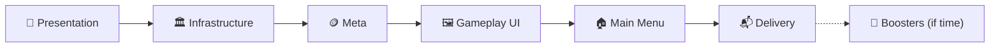

<div align="center">

# 🎬 ProductionV2

**The production plan for the vertical slice — the verified logic gets a face, an infrastructure, its screens and its meta**


<sub>[README](../../README.md) · [ProductionV1](ProductionV1.md) · [Level Format](LevelFormat.md) · [Extending](Extending.md) · [FINDINGS (prototype)](../prototype/FINDINGS.md) · [Case brief](../Game%20Developer%20Case%202026.pdf)</sub>

</div>

> [!IMPORTANT]
> **V2 goal:** The case brief's vertical slice: a playable level flow (Home → Gameplay → Win / Fail), five levels made with the Level Editor, coins and progress that survive a restart, delivered as an APK and a video.
> **Architecture goal:** Data, logic and view stay apart. The verified V1 core is **not rewritten**: presentation sits on top of it through one observer seam, and every asset, scene and config is loaded by key through Addressables, built so that remote content needs a profile change, not a code change.

| # | Section | What is in it |
|---|---|---|
| 1 | [📋 Scope](#-1-scope) | What the brief requires, what is optional, what stays out |
| 2 | [🗺️ Roadmap](#-2-roadmap) | Six stages and why in this order |
| 3 | [🎨 Presentation](#-3-presentation) | Layers, observer seam, director & sequencer, board, blocks, drag, exit, camera |
| 4 | [🏛️ Infrastructure](#-4-infrastructure) | Scopes, scenes, Addressables, asset lifetime, config, async |
| 5 | [🖼️ Gameplay UI](#-5-gameplay-ui) | HUD, booster bar, popups (MVP), pause and continue flow |
| 6 | [🏠 Main Menu & Meta](#-6-main-menu--meta) | Save, progression, wallet, settings, Home |
| 7 | [🚀 Boosters (if time)](#-7-boosters-if-time) | FreezeTime, Hammer |
| 8 | [⚡ Performance](#-8-performance) | Budget, allocation rules, how it is measured |
| 9 | [📦 Assemblies & Tests](#-9-assemblies--tests) | New assemblies and what tests them |
| 10 | [📬 Deliverables](#-10-deliverables) | README, APK, video |
| 11 | [🪜 Phase Plan](#-11-phase-plan) | Every phase with sub-steps and the test that ends it |
| 12 | [⏳ Time Budget](#-12-time-budget) | Day plan and the cut list |
| 13 | [❓ Open Questions](#-13-open-questions) | Settled when the phase that needs them starts |
| 14 | [📝 Decision Log](#-14-decision-log) | V2 decisions, numbered after V1 (D61+) |

---

## 📋 1. Scope

### Required by the brief
| Brief | Requirement | Acceptance criteria | Phase |
|---|---|---|---|
| 4.1 | **Home:** tab bar (placeholders), level button, top UI, settings button | Level button starts the current level · settings opens settings · layout correct at 1080×1920 and on 20:9 | U0, M2, M3 |
| 4.2 | **Settings:** placeholder buttons with feedback; vibration, sound, music toggles | Each toggle shows on / off · the screen closes back to Home | M0, U2, M2 |
| 4.3 | **Gameplay:** first 5 levels, timer, coins, fail popup, pause, restart, home. Boosters and lives may be placeholders | Complete a level and go to the next · timer stops the level at 0 · fail popup offers restart and home · restart leaves nothing from the last attempt · coins stay correct after leaving and returning | P1–P9, M0–M1, U0–U5, M3 |
| 4.4 | **Level editor:** width, height, doors, blocks, timer; visual; one format the game reads | A designer makes, saves and **plays** a level without code or hand-edited files · the 5 levels come from the editor | ✅ V1, P9, I5 |

### Optional (brief §5)
- **Ice blocker, Arrow block:** logic done in V1; views in P2.
- **Functional boosters:** FreezeTime and Hammer, only after every required item (§7).
- **Unsolvable-level warning (solver):** out of V2.

### Out of V2
- Other Home tabs, a working life system, shop, real downloads (no server: §4.4), new mechanics.

### Evaluation order (brief §6), and what answers it
1. **Architecture** — V1 core untouched; one observer seam; DI scopes; Addressables by key.
2. **Editor usability** — V1 + 12b; "Play" from the editor (P9, I5).
3. **Code quality** — production rules, small classes, no dead code.
4. **Correctness** — every acceptance criterion above maps to a phase and a test or a manual check.
5. **Performance** — no allocation in the update loop, measured draw calls (§8).
6. **Scope control** — the cut list (§12) protects the required items.

---

## 🗺️ 2. Roadmap



| Stage | Ends with | Why here |
|---|---|---|
| 🎨 **Presentation** | The game is fully playable and polished in one scene: board, blocks, drag, exit, Ice / Arrow, camera fit, five levels | The slice's core; once loaded, gameplay does not change with the infrastructure (D61) |
| 🏛️ **Infrastructure** | Bootstrap → Gameplay through VContainer scopes, Addressables, config, asset lifetime | Presentation is built refactor-ready, so this swaps wiring and loading only |
| 🪙 **Meta** | Save, progression, settings flags, wallet (earn and spend), continue price | The HUD, the popups and the next level read or change it, so it comes before the UI (D120) |
| 🖼️ **Gameplay UI** | HUD, booster bar, Settings / LoseLife / LevelComplete / LevelFail / Play popups, pause and continue | Uses the infrastructure's scopes and scene loader and the meta's state |
| 🏠 **Main Menu** | Home (top UI, level button, tab bar), the shared popups' Home variants, Home ↔ Gameplay | Reuses the gameplay popups; only new variants and the Main scene |
| 📬 **Delivery** | README per brief, APK, video | Android build tried early (I6), finished last |

**Refactor-ready presentation (D62):** views never know how they were loaded. They receive dependencies through `Initialize(...)` from one installer; assets come through one door (`PresentationAssets`); the level comes through Core's `ILevelSource`. In Infrastructure, the installer becomes a `LifetimeScope`, the door loads from Addressables, and the level source reads Addressables; views do not change.

---

## 🎨 3. Presentation

### Layers
```
Core (V1, untouched rules)          LevelSession ── ISessionObserver ──┐
                                                                       ▼
Runtime                       GameplayDirector  (decides what plays, owns flow & input lock)
                                    │ enqueues
                                    ▼
                              Sequencer ── steps (tween, wait, popup, camera…), awaitable, cancellable
                                    │ drives
                                    ▼
                              Views  (BoardView, BlockView, modifier views, effects)
Input ── DragController ── LevelSession.TryMove / CommitMove   (logic first, view follows)
```

### Observer seam (Core, D68)
- Core gains one interface, `ISessionObserver`, set on the session. The session calls it explicitly, like the dispatcher: no C# events, no bus (V1 D32 still holds).
- Calls: entity moved (entity, offset) · block exited (block, direction) · modifier added (entity, modifier) · modifier removed (entity, modifier) · state changed (Won / Failed / Playing).
- **Where each call comes from** (every path that changes what the view shows, D85):

| Call | Raised from |
|---|---|
| Entity moved | `LevelSession.TryMove` after a `Moved` step · `LevelCommands` applying `MoveEntity` (a listener can move walls and doors too, so it is an entity, not a block) |
| Block exited | `LevelSession.TryMove` after an `Exited` step, **before** the Exited event is dispatched, so the view hears the exit before its consequences |
| Modifier added / removed | `LevelCommands` applying `AddModifier` / `RemoveModifier` (Ice melting reaches it through `Durability.WearDown` → `RemoveModifier`) |
| State changed | One private `SetState` in `LevelSession`, used by win (`CheckWin`), fail (timeout, `Fail()` from a listener), continue (`AddTime`: Failed → Playing) and `Restart` |

- **Order inside one call:** the logic step completes, then the observer is told; commands flushed after an event report their own changes in flush order. The view therefore receives a move, the exit, then the modifier changes and finally the state change.
- `Restart` reports Playing; views rebuild from the board, not from replayed calls.
- `AddTime` from a listener changes no view directly; the HUD reads `RemainingTime`.
- A null observer is the default; Core tests do not need one.
- **The logic finishes first.** Exit and win happen in the logic immediately; the view is told and plays them later (FINDINGS: "logic finishes before the visual").

### Director & sequencer (D69)
- **Step:** one unit of presentation with `UniTask Play(CancellationToken)`. A tween, a delay, a popup, a camera move: everything is a step.
- **Sequencer:** plays steps in order; a group plays steps in parallel and waits for all. Pure C# over UniTask, tested with fake steps.
- **Director:** turns observer calls into steps and owns the flow:
  - An exit enqueues the block's exit step; other blocks stay playable (non-blocking).
  - **Win:** lock input → wait for the last exit step → short delay → win popup.
  - **Fail:** lock input → let running exit steps finish → fail popup.
- **Cancel:** restart and home cancel the whole sequence through one token; no half tween or popup survives; views are rebuilt from level data.
- **Input lock** is the director's flag; the drag controller reads it.

### Board view
- **Ground:** one GroundGrid tile per playable cell, cell pitch 2 units (FINDINGS).
- **Frame and doors:** production walls and doors are **cells**; the art's walls sit on **cell edges**. Settled by D93, D98 and D99:
  - **Walls (quadrant rule):** every wall or door cell is split into four 1×1 quadrants, and each quadrant looks at its two side neighbors and its diagonal: both sides open → outer `Corner`, one side open → `Wall` facing it, only the diagonal open → inner `Corner`, nothing open → empty. Frame, inner walls and notches follow from the one rule; a lone inner wall becomes a round pillar of 4 corners. Every piece is one `WallPiece` with its mesh swapped to `Wall` or `Corner`.
  - **Doors:** one `DoorPiece` per run of same-color, same-direction door cells, on the approach side, stretched to the run's length; its arrow stays at the run's center (D98).
- **Prefabs (D99):** the kit's prefabs only (`GroundTile`, `BlockPiece`, `ArrowPiece`, `WallPiece`, `DoorPiece`). Variety comes from mesh / material swap and run length, always through a View component on the prefab root with serialized references; code never finds a child by path.
- **Palette:** a palette asset holds the colors; one shared block and one shared door material per color are made from them at load (D74, D95). The editor's preview colors and the "colorId exists in the palette" rule (V1 D52) switch to it.

### Block view
- **BlockDrawRule** (FINDINGS shape): block cells → list of (piece, local position, rotation). Pure C#, rewritten from the prototype's knowledge, tested on L, T, U, ring and plus shapes.
- **Pieces** come from a pool; restart returns them.
- **Ice view:** frozen overlay with the remaining count; updates on each exit; melts (step) when the modifier is removed.
- **Arrow view:** fitted arrow on the run through the block's most central cell, `min(run, 3)` (FINDINGS).
- **Modifier → look (D104):** a pure C# presenter per modifier reads the logic and drives a dumb view; `ModifierPresenters.Default()` picks the presenter, so a new modifier's look is a new presenter + view and one line there (V1 additive criterion carried into presentation).

### Input & drag (FINDINGS rules)
- Pointer → ray onto the ground plane → `floor(local / 2)` → cell. No colliders.
- Free 2D drag: the logic moves toward the pointer cell by cell (larger axis first, other axis if blocked); the visual follows the pointer, clamped to reachable space: at most half a cell off its cell, never toward a refused cell.
- Release snaps to the nearest reachable cell, then `CommitMove()`.
- A block that exits mid-drag ends the move.
- The pure parts (pointer → cell, walk planning) are tested without a scene.

### Exit visual
- Snap to the door → slide through it → disabled; cut by a world clip plane in a production block shader (`Cull Off`, flat cap shade) (FINDINGS).
- Per-row particles, pooled; property blocks cached; no per-call allocation (FINDINGS cost).
- SFX: select, drop, crunch through one audio service.

### Camera fitting (D73)
- Same camera setup as the prototype.
- Fit = board bounds + margins for the HUD (top / bottom) inside the safe area → camera distance / size, for aspects from 16:9 to 20:9. Pure function, tested with numbers.

### Time & pause (D70)
- A tick adapter calls `session.Tick(dt)`. Pause stops forwarding ticks and locks input; `Time.timeScale` is not touched, so UI animations keep running.

### Restart (D71)
- The session restarts from its `LevelData` (V1). Views return to pools and are rebuilt; the sequence is cancelled. Nothing from the last attempt stays: the brief's acceptance criterion, also on the view side.

---

## 🏛️ 4. Infrastructure

> [!NOTE]
> How groups, keys, labels, loading and release work in practice, and what is built so far: [`Addressables.md`](Addressables.md).

### Scopes & scenes (D63, D64)
| Scene | In Build Settings | Scope | Holds |
|---|---|---|---|
| **Bootstrap** | ✅ the only one | Root `LifetimeScope` (lives for the whole run) | Asset loader, scene loader, save, config, audio, wallet, progression |
| **Main** | ❌ Addressable | `MainLifetimeScope` (child of root) | Home, settings |
| **Gameplay** | ❌ Addressable | `GameplayLifetimeScope` (child of root) | Session, director, views, HUD, popups |
| **LevelTest** | ❌ Editor only, not addressable | `LevelTestLifetimeScope` (a root, in place of Bootstrap's) | The level test's start (D131) |

- Scenes are minimal: they carry their `LifetimeScope` and hand-made layout; content that depends on data (board, blocks, popups) is created from code.
- Scene changes go through `ISceneLoader` only; nobody calls `SceneManager` or `Addressables.LoadSceneAsync` directly.

### Bootstrapper flow
1. Initialize Addressables.
2. Content update check (§4.4): catalog → download size → download (all no-ops locally).
3. Load config (save sections load on first use, D128).
4. Select the level (the start scene's `ILevelChoice`, D131) and open Main (from M2) or Gameplay.

### Asset lifetime (D66)
- `IAssetLoader` is the only door to Addressables. Every handle is registered in an **asset scope** owned by a `LifetimeScope`.
- Disposing a scope releases every handle it holds. Scene unload disposes its scope.
- **Tracking:** each scope counts open handles; in development builds and in tests, a scope that closes with handles still open logs them. Bundle reference counts are checked with the Addressables Event Viewer at the end of I6.
- No `Resources`, no direct asset references in scenes for data-driven content.

### Addressables without a server (D65)
- Everything is reached **by key**: level JSONs (key = level key, V1 D52), prefabs, palette, config, popups, scenes.
- Two profiles: **Local** (used) and **Remote** (defined, load path empty). Switching to a server is a profile change.
- The download flow exists and runs: `InitializeAsync` → `CheckForCatalogUpdates` → `GetDownloadSizeAsync` (0 locally) → `DownloadDependenciesAsync` (nothing to fetch). It is the path a server build would take.
- Groups by lifetime: `Boot` (config, palette), `Main`, `Gameplay`, `Levels`, `Popups`.

### Async boundary (D67)
- Core takes no package dependency: `ILevelSource` keeps returning `Task<Result<LevelData>>`.
- Runtime and Infrastructure use UniTask; Core tasks are awaited as UniTask at the edge.
- UniTask arrives in P0 (the sequencer needs it); VContainer and Addressables in I0.

### Config (D72)
- `GameConfig` (Addressable, `Boot` group): ordered level keys, popup delays; from M1 the coin reward per win, the starting coins and the continue offer (base price, price step, seconds added) (D124).
- Values that are not data stay out of code (brief: "not a plain number").

### Editor "Play" (D75)
- The Level Editor gets a **Play** button: it saves (if valid) and starts a **level test** (below) of that level.
- A plain Play in the Editor always starts the game from the Bootstrap scene (D118).

### Level test: a separate start, Editor only (D130, D131)
The game and the level test are two **start scenes** with two **root scopes**. The game knows nothing of the test; the test reuses the game's code.

```
Game (Infrastructure, Runtime, Meta)        Level test (Game.LevelTest, Editor only)
  Bootstrap.unity                              LevelTest.unity (not in Build Settings, not addressable)
  RootLifetimeScope : RootScope                LevelTestLifetimeScope : RootScope
    └ LiveServicesInstaller                      └ LevelTestServicesInstaller
                    ╲                           ╱
                     RootScope → RootInstaller, Bootstrapper, meta, scenes, Gameplay…  (shared)
```

- **Assembly wall.** `Game.LevelTest` (`Assets/Scripts/LevelTest/`) has `defineConstraints: UNITY_EDITOR`: it runs in the Editor's play mode and is never compiled into a player. It references Infrastructure, Runtime and Meta; they cannot reference it back (no cycles), so live code cannot use a test type even by mistake.
- **No mode check anywhere.** `RootScope` (Runtime) installs what both share and asks its subclass for the start scene's services (`InstallStartServices`). The game's scope always installs the live services; the test's scope always installs the test's.
- **Start.** The Level Editor's ▶ Play calls `LevelTestLauncher.Play(key)`: the key goes to `SessionState` (`PlayRequest`), `playModeStartScene` becomes `LevelTest.unity` for this one Play, and leaving play mode makes Bootstrap the start scene again (`BootstrapPlayMode`).

| Service | Game | Level test |
|---|---|---|
| Save store | `JsonSaveStore` (`persistentDataPath/Save/<key>.json`) | `MemorySaveStore`: the installer copies the live `settings` section in once and keeps no reference to the live store, so nothing in a test can write the live files |
| Starting coins (M1) | `GameConfig` | `LevelTestConfig` (D130) |
| Level to play (`ILevelChoice`) | `ProgressionLevelChoice`: progression over `GameConfig.LevelKeys` | `FixedLevelChoice`: always the tested level (start, Continue after a win, Play from Home) |
| Analytics and later services (none yet) | Real implementation | Null implementation |

- **Meta logic is the same in both.** Wallet, progression and settings run for real, so a designer tests continue, coins and Home; only where it is kept differs.
- **A new cross-cutting service** (analytics, live events, …) is an interface in live code, its real implementation in `LiveServicesInstaller`, its null / in-memory stand-in in `Game.LevelTest`.
- **Visible:** a level test shows a "LEVEL TEST" badge on every screen (U0), so a test run is never mistaken for the game.
- Test stand-ins live in `Game.LevelTest`; unit-test fakes stay in the test assemblies.

---

## 🖼️ 5. Gameplay UI
- **Canvas:** uGUI, `CanvasScaler` reference 1080×1920, match 0.5 (D137); a `SafeArea` component on every screen root (D76). Art from `Assets/Art/UI`, font LilitaOne (TMP).
- Every button gives visual feedback (brief): one shared button feedback component.
- A pointer over the UI never starts a block drag.

### UI kinds (D134)
What separates them is **who opens it and who owns it**, not how it looks.

| Kind | Opened by | Lives in | Examples |
|---|---|---|---|
| **Screen** | Nobody: it is there while its scene is | Placed by hand in its scene | Gameplay HUD, Home and its tab bar |
| **Panel** | The game flow (the director) | Placed by hand in the Gameplay scene, inactive until shown | LevelComplete, LevelFail |
| **Popup** | The player, through a button | A shared catalog of prefabs; any scene opens one by key | Settings, LoseLife, Play (Retry in Gameplay) |

- A panel belongs to its scene's flow: its content comes from the session and the meta (fail kind, reward, continue price) and it has no free X that closes it. LevelFail's X opens the Play popup in its place.
- A popup is shared and MVP: one prefab and one view per popup, its variants are data plus actions (D121). Play and Retry are the same popup.
- Panels and popups share the modal layer below; there is no second modal system.

### Canvas & modal layer (D135)
Nothing visual is placed by hand in a start scene (`Bootstrap.unity`, `LevelTest.unity`): two start scenes would mean two copies to keep in step.

```
Content scenes (Main, Gameplay) — one UIRoot prefab in each
  UIRoot: Canvas (1080×1920, SafeArea on the screen roots)
   ├ ScreenLayer   — HUD / Home
   └ ModalLayer    — dim + one slot: the shown panel or popup
  EventSystem (in UIRoot: one content scene is open at a time, D114)
For the whole run — made by code, never placed in a start scene
  LoadingCover     — prefab in the Boot group, made by the shared root code (both starts), above everything (D119)
  LEVEL TEST badge — made by LevelTestServicesInstaller, prefab from LevelTestConfig (level test only, D131)
```

- **One center is the code, not a place.** The modal host, the popup service and the catalog are written once; every scene asks them for its popups and disposes them when it closes. Where the canvas lives decides only the lifetime.
- **`UIRoot` sits in the content scenes.** Gameplay is the same scene in the game and in a level test, so no copy appears; Main and Gameplay use the same prefab. Panels share their scene with the modal layer, and popups die with the content scope (D113).
- **The loading cover** comes from `Boot` by key, so it can show only after Addressables has initialized; during that short start the camera's background shows, as today.
- **The badge** is a level test start service, like the other stand-ins: live code neither makes it nor checks for it.
- **Safe area:** the UI's content shifts into the safe area, but the dim always covers the whole screen, notch included; inside the safe area it would leave a visible gap at the notch.

- **Behaviour is code, once per canvas.** The `ModalLayer` host owns the dim, the open / close animation (sequencer steps), one modal at a time (the next replaces the current), blocking input behind it, and the pause hook: shown during play it stops the ticks and locks input; closed with resume it restarts them (D70, D122). No popup or panel prefab carries a dim or an animation.
- **Popup service** (scope-owned) sits on the modal layer: it loads a popup prefab by key (`Popups` group) through its scope's asset loader, puts it in the slot, and releases it with its scope. Panels skip the catalog: the director hands the scene's panel to the same layer.

### Building the prefabs (D135, D139)
| What | Tool | Examples |
|---|---|---|
| Behaviour | Code on the canvas's `ModalLayer`, set up once per scene | Dim, animation, one slot, input block, pause |
| Popups | **Prefabs** in `Assets/Prefabs/UI/Popups/`, loaded by key (U2.3) | `SettingsPopup`, `LoseLifePopup`, `PlayPopup` |
| Shared by two scenes | **Prefab** | `CoinCounter` (Gameplay: HUD, LevelFail · Main: Home) |
| Everything else | **Scene objects** built to the parts' structure below; no nested prefabs, no prefab variants | Buttons, toggles, header, window, lives counter; HUD and panels |

- A view's root carries its View component, whose serialized references point at its parts.
- Behaviour variants are never prefab variants: Play / Retry and Settings' Home / Gameplay are one prefab each, told apart by content and actions.
- **Contracts first.** U0 lists every view's contract below; the views are built from it before the phase that wires them.

### View contracts
What each prefab or scene object must hold so the code can wire it. The prefabs are built from this before the phase that wires them; the phase adds the root component and drags the references.

**Rules for every view**
- **Stretch, not fixed width (D137):** with match 0.5 a 20:9 screen is about 966 reference units wide, not 1080, so panels and popups are laid out with stretch anchors from the edges, never a fixed full width.
- **Safe area:** `SafeArea` goes on a view's content root, never on its dim or a full-screen backdrop (§5 Canvas).
- **Every button is built as the `PressButton` part** (U0.3); a button with no function (placeholders, boosters, tabs) is still one, with no reference.
- **Static content needs no reference:** fixed icons, fixed texts and placeholders (lives `5` and `00:00`, boosters) are set in the prefab or scene object and never touched by code.
- **Texts are TextMeshPro UI** (`TextMeshProUGUI`, font LilitaOne); a text reference is named `…Text` (`levelText`, `titleText`).

**Parts** (the same structure wherever built; only `CoinCounter` is a prefab, D139)

| Part | Built from | Component on its root | References |
|---|---|---|---|
| `PressButton` | Empty object · `Background` image · `Raycast` image (U0.3) | `PressButton` | `background`, `raycast` |
| `PopupButton` | `PressButton` with a `Label` text on `Background` (`Btn_popup_green` / `Btn_popup_blue` as variants) | — | — |
| `PriceButton` | `PopupButton` variant with a coin icon and an amount text (LevelFail's Continue) | — | — |
| `IconButton` | `PressButton` with an icon on `Background` (restart, pause, settings, home) | — | — |
| `CloseButton` | `PressButton` with `Popup_Close_Button` | — | — |
| `Toggle` | `PressButton` whose `Background` holds a `Track` image and a `Knob` image; on → off the knob slides from right to left, its sprite swaps (`btn_toggle_on` → `Btn_circle_blue_small`) and the track color swaps (green → white), and back. The setting icon stays outside `Background` | `ToggleView` | `button` (`PressButton`) · `track`, `knob` (`Image`) · `onSprite`, `offSprite` (`Sprite`) · `onColor`, `offColor` (`Color`) · `onX`, `offX` (`float`, the knob's x) |
| `CoinCounter` | A background, `Coin_Single`, an amount text, a plus `PressButton` (placeholder) | — | — |
| `LivesCounter` | `Heart`, a count text, a time text (static placeholder) | — | — |
| `Window` | `bg_popup` frame; `Header` (`bg_popup_header` + title text) | — | — |

**Views**

| View | Kind · where | Root component | References (type) |
|---|---|---|---|
| HUD | Screen · Gameplay, `ScreenLayer` | `HudView` | `levelText`, `timerText`, `coinText` (`TextMeshProUGUI`) · `restartButton`, `pauseButton` (`PressButton`) · `controls` (`CanvasGroup` on the root: every HUD control off from a win or fail until a restart or continue) · booster bar static |
| LevelComplete | Panel · Gameplay, under `ModalLayer`, inactive | `LevelCompleteView` | `rewardText` (`TextMeshProUGUI`) · `continueButton` (`PressButton`) |
| LevelFail | Panel · Gameplay, under `ModalLayer`, inactive | `LevelFailView` | `titleText`, `bonusText`, `descriptionText`, `priceText`, `coinText` (`TextMeshProUGUI`) · `icon` (`Image`) · `continueButton`, `closeButton` (`PressButton`) · `priceColor`, `priceShortColor` (`Color`, red when the wallet cannot pay) · `holdArea` (`HoldArea` on `HoldToSeeBoardArea`: reports press and release, U5.5; the fade is the modal layer's: the root `CanvasGroup` and the dim) · lives static |
| Settings | Popup · `Popups` group | `SettingsView` | `vibration`, `sound`, `music` (`ToggleView`) · `homeButton`, `closeButton` (`PressButton`; Home hidden in the Home variant) |
| LoseLife | Popup · `Popups` group | `LoseLifeView` | `titleText`, `actionText` (`TextMeshProUGUI`) · `actionButton`, `closeButton` (`PressButton`) · icon and text static |
| Play | Popup · `Popups` group | `PlayView` | `titleText`, `actionText` (`TextMeshProUGUI`) · `titleIcon` (`GameObject`: shown or hidden by the variant; the title's layout group places what is shown) · `actionButton`, `closeButton` (`PressButton`) · booster row static |
| Home | Screen · Main, `ScreenLayer` (M2) | `HomeView` | `coinText`, `levelText` (`TextMeshProUGUI`) · `levelButton`, `settingsButton` (`PressButton`) · `tabBar` (`TabBar`) · lives static |
| Tab bar | Part of Home (M2) | `TabBar`; each tab a `TabButton` | `TabBar.tabs` (`TabButton[]`) · `TabButton`: `button` (`PressButton`), `selectedLook` (`GameObject`, `ActiveTab`) |
| Loading cover | Made by code for the whole run · `Boot` group (U0.4) | `LoadingCover` | `canvas` (its own `Canvas`, sort order 100, above `UIRoot`; `CanvasScaler` as `UIRoot`; `GraphicRaycaster`) · `group` (`CanvasGroup`) · full-screen `bg_home_screen` image with an envelope `AspectRatioFitter`, no `SafeArea` |
| LEVEL TEST badge | `Assets/Prefabs/UI/LevelTestBadge.prefab`, referenced by `LevelTestConfig.badge`, made under the level test's scope by `LevelTestServicesInstaller` (U0.5) | — | own `Canvas` (sort order 90: above `UIRoot`, under the cover) + `CanvasScaler` as `UIRoot`, no `GraphicRaycaster` · `SafeRoot` (`SafeArea`) → `Badge` (top centre, raycast off) → `Label` "LEVEL TEST" |

### HUD (Gameplay screen)
- **Top:** level number · remaining time, counting down as `mm:ss` · coins (wallet) · **Restart** → LoseLife (Retry) · **Pause** → Settings. Both stop the time (D122).
- **Bottom:** booster bar, visual only (D125); its function is Stage G.

### Panels and popups (MVP, D121)
- **View:** a dumb MonoBehaviour (`SetTitle`, `SetButtonLabel`, …) that reports its buttons; no Core or Meta reference.
- **Content:** the variant's data (title, icon, labels, amounts).
- **Presenter:** pure C#, reads the meta / session and drives the view; what a button does comes through a small actions interface with one implementation per place (Home, Gameplay). A variant is new data plus actions, never a subclass.

| Name | Kind | Variant content | Buttons |
|---|---|---|---|
| **Settings** | Popup | Gameplay: with **Home** · Home: without | Vibration / SFX / Music toggles, saved, distinct on / off; only SFX acts (D126) · Home → LoseLife (Leave) · X: Gameplay resumes, Home closes · other buttons static with feedback |
| **LoseLife** | Popup (opened only in Gameplay) | "Level X" title; fixed icon and text · Retry or Leave | Retry → restart · Leave → Home · X → resume |
| **Play** | Popup | Title, title icon, booster row (visual) · Gameplay (after a fail): "Level Failed!", the heart, Retry · Home: "Level X", no heart, Play | Gameplay: Retry → restart, X → Home · Home: Play → load the level, X → close |
| **LevelComplete** | Panel | "Level Complete", coin icon, reward amount | Continue (+ amount) → next level (D123, D127) |
| **LevelFail** | Panel | Fail kind content: title, icon, `+N`, description (OutOfTime: "Out Of Time", clock, +20, "Get 20 seconds to keep playing!"); lives placeholder top left, coins top right | Continue (price) → spend and add time, or red label and nothing when the wallet cannot pay (D124) · X → Play popup (Retry) in its place |

### Flow
- Showing a panel or popup during play stops the ticks and locks input; resuming restarts them (D70, D122).
- Win: the director waits for the last exit and the delay, then shows LevelComplete (D89). The reward and the next level are saved at the win, before the panel (D123).
- Fail: running exits finish, then LevelFail with the content of its kind; the kind is read in Runtime (`RemainingTime ≤ 0` → OutOfTime).
- Restart stays in the scene (D71); next level and Home ↔ Gameplay reopen the content scene under the loading cover (D119, D127).

---

## 🏠 6. Main Menu & Meta

### Meta logic (pure C#, D77)
- **Progression:** current level index over the config's key list; after the last level it **wraps to the first** (D78).
- **Wallet:** coin balance, starting from config; a win adds the reward from config (D79); spending succeeds only when the balance covers it.
- **Continue price:** starts at the config's base (900) at every level start, restart included, and rises by the config's step after each continue (900 → 1900 → …) (D124).
- **Settings:** vibration, sound, music flags.
- All of it lives in a pure C# assembly (`Game.Meta`) and is tested without Unity.
- **Placeholders:** lives (a fixed count and `00:00`) are shown, never taken (D125).

### Save
- `ISaveStore` (Meta) → one JSON file per section in `persistentDataPath/Save/` (Infrastructure). Each feature owns its section (data class + key) and writes it on every change; there is no shared save model (D128).
- A win is saved at once: reward and next level are kept even if the player quits on the LevelComplete panel (D123).
- Brief criterion "coins stay correct after leaving and returning" is a test on wallet + storage.

### Home (Main scene)
- **Top UI:** lives placeholder · coins (wallet) · **Settings** → Settings popup (Home variant).
- **Level button:** "Level X" from progression → Play popup (Home variant): Play loads Gameplay, X closes.
- **Tab bar (D136):** a `TabBar` of `TabButton`s, each bound to a tab target through a small interface (show / hide); selecting a tab shows its target and hides the last. A new tab is a new target bound to a button, no enum or switch. In V2 every tab is a placeholder: its target only plays the button feedback and is never selected.
- **Navigation:** Home → Gameplay (Play) · Gameplay → Home (Leave, Play popup X) · LevelComplete → next level.

---

## 🚀 7. Boosters (if time)
Only after Delivery is secured (D80).
- **FreezeTime:** stops ticks for N seconds (config); a view and a HUD button.
- **Hammer:** removes a chosen block. Needs a logic decision: removal through a new session operation, counted as an exit or not (open question when it starts).
- Both cost coins from the wallet.

---

## ⚡ 8. Performance
- **Mode:** production rules (`.claude/rules/production/allocation.md`): no LINQ, closures, boxing or per-frame `new` on hot paths.
- **Hot paths:** drag (every pointer move), tick, sequencer step scheduling, exit particles.
- **Pools:** block pieces, exit particles, popups per scope.
- **Draw calls:** one shared material per palette color; GPU instancing on block and ground materials where the shader allows; the exit clip uses a cached property block only while a block exits (FINDINGS cost).
- **Evidence, not claims:** Frame Debugger batch count and a Profiler GC Alloc capture during a drag, before and after P8, recorded as a table in P8. A mid-range Android check in I6 / Delivery.

### Measurements (P8)
Recorded in [`Performance.md`](Performance.md): draw calls 183 → 15, no allocation per frame, and the small per-action garbage accepted on purpose with its known fixes (D108, D109).

---

## 📦 9. Assemblies & Tests

| Assembly | Contents | References |
|---|---|---|
| `Game.Core` (V1) | Logic + `ISessionObserver` seam | — |
| `Game.LevelIO` (V1) | JSON | Core, Newtonsoft |
| `Game.Meta` | Progression, wallet, settings, each with its save section; `ISaveStore`. **No UnityEngine** | — |
| `Game.Runtime` | Presentation (director, sequencer, views, input, camera), UI, scopes | Core, LevelIO, Meta, Infrastructure, UniTask, DOTween, VContainer |
| `Game.Infrastructure` | Asset loader & scopes, scene loader, Addressables flow, save storage, config loading | Core, LevelIO, Meta, UniTask, VContainer, Addressables |
| `Game.LevelEditor` (V1) | Editor; gains Play (P9, I5) | Core, LevelIO |
| `Game.Tests.Meta` | Meta tests | Meta |
| `Game.Tests.Runtime` | EditMode tests of Runtime's pure parts (sequencer, draw rule, camera fit, drag resolver) | Runtime |
| `Game.Tests.Infrastructure` | Asset scope tracking with a fake loader | Infrastructure |
| `Game.Tests.PlayMode` | Only where the Unity runtime is required (scene flow smoke test) | Runtime |

- V1 rules hold: Core and Meta never see UnityEngine; fakes over mocks; every phase ends with a named test.
- Folder depth stops at 2 under an assembly root (code-shape rule); a crowded assembly splits.
- Packages added in V2: UniTask (P0), VContainer and Addressables (I0).

---

## 📬 10. Deliverables
| Item | Content | Phase |
|---|---|---|
| **README** | How to open and run · how to open the editor and make a level · architecture decisions and reasons · known problems · LLM tools and what they were used for · approximate work time | R1 |
| **APK** | Android build, Addressables built first | I6 (smoke), R2 |
| **Video** | ≤ 3 min, full flow: Home → level → win → next → fail → restart → home → settings | R2 |
| **Asset feedback** | Problems found in the supplied assets (FINDINGS: mesh-level fixes, wall run stretching) | R1 |

---

## 🪜 11. Phase Plan
One phase per answer, following the production process. **Files touched** are decided when each phase starts. A visual phase ends with its pure-C# test plus a stated check in the Editor.

### 🎨 Stage A: Presentation
| # | Phase | Sub-steps | Done when | Status |
|---|---|---|---|---|
| P0 | Runtime Skeleton | • P0.1 UniTask package<br>• P0.2 `Game.Runtime` + `Game.Tests.Runtime` asmdefs<br>• P0.3 `ISessionObserver` in Core, called by the session<br>• P0.4 Gameplay scene + manual `GameplayInstaller` + `TextAsset` level source | `Session_TellsTheObserver_MovesExitsRemovalsAndState` | ✅ |
| P1 | Board View | • P1.1 palette asset + one material per color<br>• P1.2 ground tiles for playable cells<br>• P1.3 frame and doors (D93, D98, D99)<br>• P1.4 inner walls | `WallDrawRule_DressesFrameInnerWallsAndDoors` + level visible in the Editor | ✅ |
| P2 | Block View | • P2.1 `BlockDrawRule` (pure)<br>• P2.2 pooled pieces (`BlockPiece` / `ArrowPiece` + `PieceView` mesh swap, D99)<br>• P2.3 Arrow view<br>• P2.4 Ice view with count<br>• P2.5 modifier → view asset mapping | `BlockDrawRule_DressesLTURingAndPlus` | ✅ |
| P3 | Camera Fit | • P3.1 fit function (bounds, HUD margins, safe area, aspect)<br>• P3.2 camera applies it on level load | `CameraFit_KeepsTheBoardInside_From16x9To20x9` | ✅ |
| P4 | Input & Drag | • P4.1 pointer → cell (`BoardRaycast`)<br>• P4.2 drag resolver (move toward the pointer)<br>• P4.3 clamp to reachable, snap, `CommitMove`<br>• P4.4 exit mid-drag ends the move | `DragResolver_MovesTowardThePointer_LargerAxisFirst` | ✅ |
| P5 | Director & Sequencer | • P5.1 step contract + sequencer (order, parallel, cancel)<br>• P5.2 director: exit steps non-blocking<br>• P5.3 input lock<br>• P5.4 win / fail sequences (popup placeholder step) | `Sequencer_PlaysInOrder_GroupsInParallel_AndCancels` | ✅ |
| P6 | Exit Visual & Feedback | • P6.1 production block shader with clip plane<br>• P6.2 exit step (snap, slide, cut)<br>• P6.3 pooled row particles<br>• P6.4 SFX service | `ExitStep_CompletesAndDisablesTheBlock` (step with a fake view) + exit seen in the Editor | ✅ |
| P7 | Restart & Lifecycle | • P7.1 cancel sequence, return pools, rebuild<br>• P7.2 tick adapter, pause stops ticks | `Restart_LeavesNoViewOrStepFromTheLastAttempt` | ✅ |
| P8 | Polish & Performance | • P8.1 feel pass (tuning from FINDINGS)<br>• P8.2 draw call pass (shared materials, instancing)<br>• P8.3 GC Alloc pass on drag / tick<br>• P8.4 measurement table | Measurement table recorded (batches, GC Alloc per frame) | ✅ |
| P9 | Five Levels & Editor Play | • P9.1 Play button (save → open Gameplay with the key)<br>• P9.2 build levels 1–5 in the editor<br>• P9.3 palette rule in the editor | `PlayRequest_StoresTheLevelKey_ForTheGame` + five levels played | ✅ |

### 🏛️ Stage B: Infrastructure
| # | Phase | Sub-steps | Done when | Status |
|---|---|---|---|---|
| I0 | Packages & Root Scope | • I0.1 VContainer, Addressables<br>• I0.2 `Game.Infrastructure`, `Game.Meta` + test asmdefs<br>• I0.3 Bootstrap scene + root `LifetimeScope` | `RootScope_ResolvesItsServices` | ✅ |
| I1 | Asset Loader & Scopes | • I1.1 `IAssetLoader` over Addressables<br>• I1.2 asset scope: register, release on dispose, open-handle count<br>• I1.3 leak log in development | `AssetScope_ReleasesEveryHandle_OnDispose` | ✅ |
| I2 | Scene Loader | • I2.1 `ISceneLoader` over Addressables scenes<br>• I2.2 child scopes for Main / Gameplay<br>• I2.3 scene unload disposes its scope | `SceneFlow_BootstrapToGameplay_AndBack` (PlayMode smoke) | ✅ |
| I3 | Addressables Setup | • I3.1 groups and keys<br>• I3.2 Local / Remote profiles<br>• I3.3 content update flow (init → catalog → size → download) | `ContentUpdate_RunsEveryStep_WithNothingToDownload` | ✅ |
| I4 | Config & Level Source | • I4.1 `GameConfig`<br>• I4.2 Addressables level source<br>• I4.3 `GameplayInstaller` → `GameplayLifetimeScope`; `PresentationAssets` from Addressables | `LevelSource_LoadsByKey_AndRejectsAnUnknownKey` | ✅ |
| I5 | Editor Play via Bootstrap | • I5.1 Play enters play mode from Bootstrap<br>• I5.2 bootstrapper honours the stored key | `Bootstrapper_OpensTheRequestedLevel_WhenOneIsStored` | ✅ |
| I6 | Release Check & Android Smoke | • I6.1 Event Viewer: no bundle left after Gameplay → Bootstrap<br>• I6.2 first APK on a device | Zero open handles after a full scene round trip + APK runs | ✅ |

### 🪙 Stage C: Meta
| # | Phase | Sub-steps | Done when | Status |
|---|---|---|---|---|
| M0 | Save, Progression & Settings | • M0.1 `Game.Meta` + `Game.Tests.Meta` asmdefs<br>• M0.2 `ISaveStore` + per-feature sections + `JsonSaveStore`<br>• M0.3 progression with wrap; the bootstrapper selects its level (the Level Editor's request still wins)<br>• M0.4 settings flags | `Progression_WrapsToTheFirstLevel_AfterTheLast` | ✅ |
| M0b | Level Test Start | • M0b.1 `RootScope` (Runtime): shared root wiring + `InstallStartServices`; `RootLifetimeScope` installs `LiveServicesInstaller`<br>• M0b.2 `Game.LevelTest` assembly (Editor only, `UNITY_EDITOR`) with `LevelTestLifetimeScope`, `LevelTestServicesInstaller`, `MemorySaveStore` (only the live `settings` section copied in), `FixedLevelChoice`, the play request<br>• M0b.3 `LevelTest.unity` start scene; Level Editor ▶ Play → `LevelTestLauncher`<br>• M0b.4 `ILevelChoice` behind `SelectedLevel`. `LevelTestConfig` moves to M1 and the badge to U0, where they first have a reader | `LevelTestLaunch_KeepsTheLiveSaveUntouched` | ✅ |
| M1 | Wallet & Continue Price | • M1.0 `Meta/` passes 6 files: `Progress/` (progression, level completion) and `Economy/` (wallet, continue price, starting coins); settings stay at the root (D100, D133)<br>• M1.1 wallet (`Wallet` + `WalletData` section): start coins, earn, spend only when covered<br>• M1.2 config: reward, start coins, continue base / step / seconds; `LevelTestConfig` (Editor only, D130) gives the LevelTest start coins<br>• M1.3 a win adds the reward, advances progression and saves at once (D123)<br>• M1.4 continue price per level start (D124)<br>• M1.5 `StartServices_RegisterTheSameContracts`: both start installers resolve the same contract list (`ISaveStore`, `ILevelChoice`, the wallet's start coins), so a contract added to only one turns the test red (architecture.md § Start services) | `Coins_StayCorrect_AfterLeavingAndReturning` | ✅ |

### 🖼️ Stage D: Gameplay UI
| # | Phase | Sub-steps | Done when | Status |
|---|---|---|---|---|
| U0 | Canvas, Safe Area & Contracts | Order: U0.2 → U0.1 → U0.3 → U0.6 → U0.4 → U0.5, one sub-step at a time<br>• U0.1 `UIRoot` prefab in Gameplay: 1080×1920 scaler, `ScreenLayer` / `ModalLayer` (D135)<br>• U0.2 `SafeArea`<br>• U0.3 `PressButton` alone on an empty object, no Unity `Button`; children `Background` (raycast off, the target that shrinks while pressed) and `Raycast` (the fixed hit area; its Raycast Target is the button's on / off, set in the Editor or from code); a release over it is a click (`Clicked`), dragging off cancels<br>• U0.4 loading cover over every content scene change, lifted when the scene is ready (D119); a `Boot` prefab made by the shared root code, so both starts get it without a copy in their scene (D135)<br>• U0.5 "LEVEL TEST" badge in level tests, made by `LevelTestServicesInstaller` from a prefab in `LevelTestConfig`; live code never makes or checks it (D131, D135)<br>• U0.6 view contracts (§5): every screen, panel, popup and part with its root component and serialized references, so the prefabs are built before the phase that wires them (D135) | `SafeArea_FitsTheRect_ForA20x9Notch` | ✅ |
| U1 | HUD | • U1.1 level number, `mm:ss` countdown, coins<br>• U1.2 restart and pause buttons (they open their popups from U2 / U3)<br>• U1.3 booster bar, visual only<br>• U1.4 a pointer over the UI starts no drag | `TimerText_ShowsMinutesAndSeconds_AndStopsAtZero` | ✅ |
| U2 | Modal Layer, Popups & Settings | • U2.1 `ModalLayer`: dim, one slot (the next replaces the current), open / close as sequencer steps, input blocked behind it (D135)<br>• U2.2 shown during play it stops the ticks and locks input; closed with resume it restarts them (D122)<br>• U2.3 popup service on the modal layer: scope-owned catalog by key (`Popups` group), released with its scope<br>• U2.4 Settings popup, Gameplay variant: three saved toggles, SFX mutes the SFX player, X resumes (D126) | `PopupService_ReleasesThePopup_WhenItsScopeCloses` | ✅ |
| U3 | LoseLife & Restart | • U3.1 LoseLife popup (MVP, opened only in Gameplay, D134): "Level X", Retry / Leave variants, X resumes<br>• U3.2 HUD restart → Retry → restart in the scene<br>• U3.3 Settings Home → Leave (goes Home from M3) | `LoseLifePresenter_RunsItsVariantsAction` | ✅ |
| U4 | Level Complete Panel | • U4.1 LevelComplete panel, placed in the Gameplay scene (D134): title, coin icon, reward on Continue<br>• U4.2 director shows it through the modal layer after the last exit step and the delay<br>• U4.3 Continue → next level, scene reopened under the cover (D127) | `Director_ShowsWin_AfterTheLastExitStep` | ✅ |
| U5 | Level Fail Panel & Play Popup | • U5.1 LevelFail panel, placed in the Gameplay scene; fail kinds as content, OutOfTime first (D134)<br>• U5.2 Continue: spend the price and `AddTime`, or red label and no action<br>• U5.3 lives placeholder and coins<br>• U5.4 X → Play popup in the panel's slot, Gameplay variant: Retry restarts, X → Home (from M3), boosters visual<br>• U5.5 hold to see the board: holding the panel's hold area fades the whole LevelFail panel and the modal layer's dim out, releasing fades them back in (D138) | `FailPresenter_Continues_OnlyWhenTheWalletCanPay` | ⏳ |

### 🏠 Stage E: Main Menu
| # | Phase | Sub-steps | Done when | Status |
|---|---|---|---|---|
| M2 | Home | • M2.1 Main scene + `MainLifetimeScope` (`Main` group) with the canvas skeleton of U0; the bootstrapper opens Main; a level test starts in Gameplay (D131), and Home reached from a level test shows the test's values, never the live ones (D130)<br>• M2.2 top UI: lives placeholder, coins, Settings popup (Home variant)<br>• M2.3 level button → Play popup (Home variant)<br>• M2.4 tab bar: `TabBar`, `TabButton`, tab target; every tab a placeholder that only gives feedback (D136) | `LevelButton_ShowsAndStartsTheCurrentLevel` | ⏳ |
| M3 | Navigation | • M3.1 Leave and Play popup X → Home<br>• M3.2 Home → Gameplay → win → next → fail → Home | `SceneFlow_HomeLevelWinNextFailHome` (PlayMode smoke) | ⏳ |

### 📬 Stage F: Delivery
| # | Phase | Sub-steps | Done when | Status |
|---|---|---|---|---|
| R1 | README | • R1.1 every brief §7 item<br>• R1.2 asset feedback<br>• R1.3 known problems | Every brief §7 point present | ⏳ |
| R2 | APK & Video | • R2.1 Addressables + Android build<br>• R2.2 full-flow recording ≤ 3 min | APK installed and played; video uploaded | ⏳ |

### 🚀 Stage G: Boosters (if time)
| # | Phase | Sub-steps | Done when | Status |
|---|---|---|---|---|
| B1 | FreezeTime | • B1.1 tick pause for N s<br>• B1.2 HUD button + cost | `FreezeTime_StopsTheTimer_ForItsDuration` | ⏳ |
| B2 | Hammer | • B2.1 logic decision (open question)<br>• B2.2 pick a block<br>• B2.3 cost | `Hammer_RemovesTheChosenBlock` | ⏳ |

---

## ⏳ 12. Time Budget
~45 hours over 3 days (D81).

| Day | Stages | Estimate |
|---|---|---|
| 1 | 🎨 Presentation P0–P9 | 14–15 h |
| 2 | 🏛️ Infrastructure I0–I6 | 14–15 h |
| 3 | 🪙 M0–M1 (+ M0b) · 🖼️ U0–U5 · 🏠 M2–M3 · 📬 R1–R2 | 14–15 h |

**Cut list, first to go:**
1. 🚀 Boosters.
2. P8.1 feel pass beyond FINDINGS values.
3. I3.3 content update flow reduced to `InitializeAsync` + the Remote profile only.
4. PlayMode smoke tests replaced by a scripted manual check in the README.

The brief's acceptance criteria (§1) are never cut.

---

## ❓ 13. Open Questions

| # | Question | Needed by | Answer |
|---|---|---|---|
| Q1 | **Frame cells vs. edge art.** Walls and doors are cells in production, but the kit's walls sit on cell edges. How is the frame drawn? | P1 | ✅ D86 |
| Q2 | Does the board view read the `Board` directly, or a view model built once from `LevelData`? | P1 | ✅ D87 |
| Q3 | Ice view: count shown as text or as cracks per stage? | P2 | ✅ D88 |
| Q4 | Win popup timing: fixed delay after the last exit, or after the exit particles end? | P5 | ✅ D89 |
| Q5 | Is `Game.Runtime` one assembly with UI inside, or UI separate? | P0 | ✅ D90 |
| Q6 | Hammer: is a hammered block an exit (counts for Ice, listeners) or a removal? | B2 | Open; decided when B2 starts |

---

## 📝 14. Decision Log
V1 decisions (D1–D60) still hold; see [ProductionV1 §16](ProductionV1.md#-16-decision-log).

| # | Topic | Decision |
|---|---|---|
| D61 | Stage order | Presentation → Infrastructure → Gameplay UI → Main Menu & Meta → Delivery. Boosters only if time — order after Infrastructure revised by D120 |
| D62 | Refactor-ready presentation | Views know nothing about loading: `Initialize(...)` from one installer, assets through one door (`PresentationAssets`), the level through `ILevelSource`. Infrastructure swaps the installer for a `LifetimeScope` and the door for Addressables |
| D63 | Scenes | Minimal scenes that carry a `LifetimeScope` and hand-made layout; data-driven content is created from code. Only Bootstrap is in Build Settings |
| D64 | DI | VContainer. Root scope in Bootstrap for the whole run; Main and Gameplay are child scopes. A `LifetimeScope` is the composition root (replaces V1's manual `GameInstaller` rule) |
| D65 | Addressables | Every asset, scene, config and level by key. Local profile used; Remote profile defined for a future server; the content update flow runs and finds nothing to download. No `Resources` |
| D66 | Asset lifetime | One `IAssetLoader`; every handle belongs to an asset scope owned by a `LifetimeScope`; disposing releases all; open handles are counted and logged in development and tests |
| D67 | Async boundary | Core takes no package: `ILevelSource` stays `Task<Result<LevelData>>`. Runtime and Infrastructure use UniTask (added in P0) |
| D68 | Logic → view | One Core seam, `ISessionObserver`, called explicitly by the session (moved, exited, modifier removed, state changed). No C# events, no bus; null observer by default |
| D69 | Director & sequencer | Presentation runs through a director that turns observer calls into steps and a sequencer that plays them in order or in parallel groups, awaitable and cancellable. Win / fail wait for their steps; restart and home cancel everything with one token |
| D70 | Pause | Stops forwarding ticks and locks input; `Time.timeScale` is not used |
| D71 | Restart | Session restarts from `LevelData`; views go back to pools and are rebuilt; the sequence is cancelled |
| D72 | Config | `GameConfig` Addressable: level keys in order, coin reward, presentation delays. Tunable values are data, not literals |
| D73 | Camera | Prototype camera kept; a fit function places the board inside the safe area with HUD margins, 16:9 to 20:9 |
| D74 | Materials | One shared material per palette color; colors come from the palette asset, never `new Material` per block — for blocks superseded by D108 |
| D75 | Editor Play | Level Editor Play saves, stores the key in `SessionState` and enters play mode; from I5 always through the bootstrapper |
| D76 | UI | uGUI, `CanvasScaler` 1080×1920, `SafeArea` on every screen root, one shared button feedback |
| D77 | Meta | Progression, wallet and settings are pure C# in `Game.Meta`; storage behind `ISaveStorage`, JSON in `persistentDataPath` — storage shape refined by D128 (`ISaveStore`, one section per feature) |
| D78 | Progression | After the last level the game wraps to the first |
| D79 | Coins | A win adds a fixed reward read from config |
| D80 | Boosters | FreezeTime and Hammer, only after Delivery is secured |
| D81 | Budget | Three days, ~45 hours; the cut list protects the brief's acceptance criteria |
| D82 | Messaging | No message bus library; services are injected. Revisited only if a real need appears |
| D83 | Deliverables | Both an APK and a video; the Android build is tried in I6, before the last day |
| D84 | Tweens | DOTween stays for production tweens, awaited through UniTask's DOTween support |
| D85 | Observer call points | `ISessionObserver` also hears modifier added and entity moved (not only blocks). Calls come from `LevelSession` (moves, exits, one `SetState` for every state change incl. continue and restart) and `LevelCommands` (command moves, modifier add / remove). The exit is reported before its event is dispatched |
| D86 | Frame drawing (Q1) | ~~The frame ring is drawn as the prototype's thin border on the edge between a frame cell and a playable cell; same-color door cells in a line become one door run; inner wall cells use full wall pieces~~ — superseded by D93 and D94 |
| D87 | Board view source (Q2) | Views read `Board` read-only for positions; static layout (frame, ground) is built once from `LevelData` |
| D88 | Ice view (Q3) | Remaining count as text; crack stages only if time |
| D89 | Win popup timing (Q4) | After the last exit step finishes, plus a delay from config |
| D90 | Runtime assembly (Q5) | `Game.Runtime` is one assembly with UI inside; split only when a folder would pass depth 2 |
| D91 | `Resources` exception | `Assets/Resources/DOTweenSettings.asset` stays: DOTween requires it. It is the only `Resources` use; game content never goes there (D65) |
| D92 | Case brief | `docs/Game Developer Case 2026.pdf` is kept locally and ignored by git |
| D93 | Wall drawing | Quadrant rule over solid cells (walls and doors): both sides open → outer `Corner`, one side open → `Wall` facing it, only the diagonal open → inner `Corner`, else nothing. One rule for frame, inner walls and notches; each piece is a 1×1 `WallPiece` with the `Wall` or `Corner` mesh. Known gap: the middle of a 2×2 or larger inner wall block stays empty, the kit has no fill piece |
| D94 | Door drawing | ~~One door piece per door cell on its approach side, no stretching; one arrow per run of door cells with the same color and direction, across door entities. The kit's `DoorPiece` is split into `DoorCell` and `DoorArrow` prefabs~~ — superseded by D98 |
| D95 | Palette materials | The palette asset holds colors only. `PaletteMaterials` makes one block and one door material per color from the kit's template materials at load, shares them, and destroys them when its owner closes |
| D96 | P1 test | `WallDrawRule_DressesFrameInnerWallsAndDoors` replaces `FrameRuns_GroupDoorsAndWalls_ByEdge` |
| D97 | Asset folders | Materials live under `Assets/Art/Materials/`, shaders under `Assets/Art/Shaders/`. ScriptableObject assets live under `Assets/ScriptableObjects/`, grouped in concept subfolders (`Presentation/`: palette, presentation assets) |
| D98 | Door drawing | One `DoorPiece` per run of door cells with the same color and direction (across door entities), on the run's approach side; the door mesh is stretched to the run's length, the arrow stays unscaled at the center (prototype method) |
| D99 | Prefabs & views | Only the kit's prefabs (`GroundTile`, `BlockPiece`, `ArrowPiece`, `WallPiece`, `DoorPiece`); no prefab per piece kind. Variety comes from mesh / material swap and run length, through a View component on the prefab root (`PieceView`, `DoorPieceView`) whose references are serialized; code never finds a child by path. Meshes are referenced from `PresentationAssets` |
| D100 | Folder size | A code folder holds at most 6 files; the change that adds the 7th splits it into concept subfolders, the root keeping the central types. Checked at the end of every phase (`code-shape.md` § Folders). Applied in P1 to `Runtime/Board` (`Drawing/`), `Core/Session` (`Win/`) and its tests |
| D101 | Modifier → view | ~~A `ModifierViews` asset lists `ModifierView` prefabs. Each view says which modifier it draws (`Accepts`, a type check in its own class); the first that accepts draws it, none means no look. A new modifier's look is a new view class and one list entry; no reflection, no Core change~~ — superseded by D104 |
| D102 | Ice view | The frozen block's parts switch to one shared ice material (`Art/Materials/Ice.mat`, shader `Game/IceBlock`: lit and opaque so studs keep their shading, two fixed ice colors blended by the ice texture projected triplanar in world space, crack detail and a view rim); the remaining count is 3D text on the block's anchor cell |
| D103 | Arrow view | ~~The kit's arrow is single-headed and points the Arrow modifier's direction~~ — corrected by D105; `ArrowView` sits on `ArrowPiece` and swaps `Arrow_1/2/3` by run length (`min(run, 3)`). A serialized yaw offset fixes the mesh's own orientation |
| D104 | View / presenter | Views are dumb MonoBehaviours with no `Game.Core` reference (`IceView.SetCount`, `ArrowView.Show`). A pure C# presenter per modifier (`IcePresenter`, `ArrowPresenter`) reads the logic (casts, `Durability`, placement rules) and drives its view; `ModifierPresenters.Default()` picks the first presenter that accepts a modifier. A new modifier's look adds a presenter, a view, one line in `Default()` and one field in `ModifierViews`. `BlockView` no longer exposes the `Block`. Rule in `architecture.md` § View / Presenter |
| D105 | Arrow = axis lock | Arrow locks a block to an axis, `Horizontal` or `Vertical`, both ways (prototype behaviour); supersedes V1 D18 (one direction). Core gains `Axis` and `Direction.ToAxis()`; `Arrow.Allows` converts the move's direction to its axis. Saved as `"axis"`, a new field kind; `schemaVersion` 1 → 2, the levels re-saved by hand, no migration (LevelFormat §2 version history). The kit's `Arrow_N` is double-headed: laid along Z for Vertical, X for Horizontal. The drag keeps its previous-cell rule (`DragResolver.ClampToReachable` may offset back toward the cell the last move left) for future one-way mechanics |
| D106 | Drag naming | Names say what the code does, not a hand metaphor; input uses Unity Input System words. `IPointerInput` (`WasPressedThisFrame`, `IsPressed`, `PointerRay`), `MousePointerInput`, `BoardRaycast` (`TryGetCellPoint`, `ToCell`), `DragResolver` (`MoveToward`, `ClampToReachable`, `BeginDrag`), `DragController` (`TrySelectBlock`, `UpdateDrag`, `EndDrag`), `DragSettings` (`LiftHeight`, `SnapDuration`), `BlockView.SetPosition` / `SnapTo` |
| D107 | Move preview | Core decides every move, also the ones presentation only previews. `BlockMover.Preview` holds the move rule and `TryMove` applies its answer; `LevelSession.PreviewMove` exposes it without changing the board or telling the observer. `DragResolver.ClampToReachable` leans only where the preview says `Moved`; Runtime no longer combines `Capabilities` and `Board.CanPlace` itself. Board occupancy is still read for two view-only cases: the diagonal lean and the cell the last move left |
| D108 | Instanced drawing (P8.2) | Every block shares one instanced `Game/Block` material; its color is a per-instance property (`UNITY_DEFINE_INSTANCED_PROP _Color`) set through one reused `MaterialPropertyBlock`, so pieces of one mesh draw together whatever their color. Exit particles use the same material with their color set once. Doors keep one material per color. Walls and door arrows draw with instanced copies of the kit's FBX-embedded materials; `Ground`, `Arrow` and `Ice` materials and the `IceBlock` shader are instanced. Static batching was not used: runtime combining needs Read/Write meshes and instancing already covers the repeats. Known cost: an exiting block's clip plane is not per instance, so that block draws alone until it is gone. Supersedes D74 for blocks |
| D109 | Tween garbage | Measured on Android (IL2CPP): DOTween's `DOLocalMove` cost ~0.6 KB per release and ~0.7 KB per exit (new getter / setter closures and a new tween each call). `BlockView` moves through `DOTween.To` with a getter and setter made once per view, and marks its tweens recyclable; no tween reference is kept past its end, so a recycled tween is never touched again. Recycling stays per tween, not global |
| D110 | Editor Play & palette (P9) | The Level Editor's **▶ Play** saves (rules first), stores the key through `PlayRequest` in `SessionState`, opens the Gameplay scene and enters play mode. The installer takes the request once and reads that level straight from `Assets/Levels/<key>.json` (`EditorFileLevelSource`, Editor only), so a new level plays without being added to any list; without a request it plays its own level. `Game.LevelEditor` references `Game.Runtime` for the request and the palette. The editor's colors come from the palette asset, and `PaletteColorRule` closes V1's deferred "colorId exists in the palette" rule. I5 moves Play behind the bootstrapper |
| D111 | Early exit & selection | A block beside its door leans into it (the preview says `Exited`) and exits once the pointer pulls it `DragSettings.ExitThreshold` (0.3) of a cell toward the door, instead of at the half-cell where the pointer would round onto the door. Core still decides: the early exit only acts where `PreviewMove` says `Exited`. The held block gets the prototype's screen-space outline (`Game/SelectionOutline` through a camera command buffer, material in `PresentationAssets`), shown on select and hidden on release, exit and restart |
| D112 | Root scope (I0) | Packages: VContainer 1.19.0 (git tag), Addressables 1.29.0 (last 1.x, Unity 2021.3+). The root scope's registrations live in a pure `RootInstaller` (Infrastructure, VContainer `IInstaller`) so a test builds them without a scene; `RootLifetimeScope` (Runtime) only calls it. I0 registers `IContentInitializer` (Addressables `InitializeAsync`) and the `Bootstrapper` entry point; later services join as their phases arrive. `Game.Meta` and `Game.Tests.Meta` open in M0, when they get code, not as empty assemblies in I0 |
| D113 | Asset scope (I1) | `IAssetSource` is the raw Addressables door (a failed or cancelled load releases its own handle); `AssetScope : IAssetLoader` keeps every handle it loads and releases them all on `Dispose`. Registered `Lifetime.Scoped`, so each `LifetimeScope` owns one and VContainer disposes it with the scope. A **leak** is a handle that would outlive its scope: a load finishing after `Dispose` is released at once, logged as a warning in the Editor and development builds, and the caller sees a cancel. Assets are `UnityEngine.Object`; an unknown key throws (the level source turns it into a `Result` in I4) |
| D114 | Scene flow (I2) | Bootstrap stays loaded for the whole run and is the only scene in Build Settings; the root scope lives with it, no `DontDestroyOnLoad`. One content scene at a time is opened **additively** by `ISceneLoader` (`AddressablesSceneLoader`), made active so objects created from code land in it, and unloaded before the next opens. Its `LifetimeScope` gets the root as parent through `LifetimeScope.EnqueueParent`, so a scene played alone in the Editor runs without a parent (Level Editor Play keeps working until I5). Until M2 the bootstrapper opens Gameplay; `Main` and `MainLifetimeScope` arrive in M2 with their content. `GameplayLifetimeScope` registers nothing until I4 moves `GameplayInstaller`'s wiring into it |
| D115 | Addressables setup (I3) | Groups are made by hand once (checklist in `Addressables.md` §8) and created only when their first asset exists: `Gameplay` (the scene, Local, Pack Together) and `Levels` (`Level_1`–`Level_6`, Remote paths, **Pack Separately**, label `remote`) now; `Boot` in I4, `Main` in M2, `Popups` in U2. Groups use the profile's Local / Remote bundle locations; the **Default** profile (it cannot be renamed) sets Remote to `Built-In`, the **Remote** profile to `Custom` (`ServerData`, empty load path), so a server is a profile change only. Catalogs update only manually; a remote catalog is built. The start-up content update (`ContentUpdate` over `IContentDelivery`) checks catalogs, updates only changed ones, then cleans cached bundles the new catalogs no longer use (`CleanBundleCache` once `Caching.ready`; a failed cleaning only warns, since inside `UpdateCatalogs` it failed the whole update on Android), sizes and always runs the download of `remote` (nothing to fetch locally) |
| D116 | Config & level source (I4) | `GameConfig` (Infrastructure, Addressable `GameConfig` in the new `Boot` group) holds the level keys in play order (`Level_1`–`Level_5`; `Level_6` stays playable through the Level Editor only) and the win popup delay; coins join in M1. The root container is built before the config can load, so a root singleton `LoadedConfig` is set once by the bootstrapper (after the content update, before the first scene) and throws if read earlier. Levels come through `AssetLevelSource` (scoped, over the scope's `IAssetLoader`), an unknown key is a failed `Result`. Until M0 the game plays the first key. I4 is written in two steps: 4a config and level source, 4b `GameplayInstaller` → `GameplayLifetimeScope` and `PresentationAssets` from Addressables. Level Editor Play stops working after 4b until I5 moves it behind the bootstrapper |
| D117 | Gameplay scope (I4b) | `GameplayInstaller` is gone. `GameplayLifetimeScope` carries the scene's references and settings (camera rig, drag and exit settings) and runs `GameplayEntry` (`IAsyncStartable`, VContainer `ITickable`, `IDisposable`): it loads `PresentationAssets` (Addressable in the `Gameplay` group; its prefabs, meshes, materials and palette come as dependencies, so the palette stays out of `Boot`) and the level by key, then builds the session, views and play objects by hand, because they depend on loaded data. Everything it creates is parented under the scope's object, so it lives and dies with the scene whatever the active scene is. VContainer's tick replaces `FrameTicker`; `TextAssetLevelSource` is removed. `EditorFileLevelSource` stays for I5 |
| D118 | Editor Play via Bootstrap (I5) | Every Play in the Editor starts from the Bootstrap scene (`EditorSceneManager.playModeStartScene`, set by `BootstrapPlayMode` in a new `Game.Infrastructure.Editor` assembly), whatever scene is open. The Level Editor's ▶ Play stores the key (`PlayRequest`, moved to Infrastructure; the composition root `RootLifetimeScope` picks its store: `EditorPlayRequestStore` over `SessionState`, compiled only in the Editor, or `NoPlayRequests` in a player, so no editor type reaches a build) and enters play mode; the bootstrapper's `SelectedLevel.SelectFirst()` takes the request, else `GameConfig.LevelKeys[0]`, and `GameplayEntry` plays `SelectedLevel.Key`. Saving a level in the Level Editor makes it addressable (`Levels` group, key = file name, label `remote`), so one load path serves the editor and the build; `EditorFileLevelSource` is removed. `LoadedConfig` now loads itself through the root asset loader. Supersedes the file source of D110. Request handling superseded by D131 |
| D119 | Loading cover (U0.4) | A full-screen cover lives for the whole run (made by the shared root code, not placed in Bootstrap: D135) and fades in before `ISceneLoader` changes the content scene; it fades out when the new scene says it is built (`GameplayEntry` at the end of `BuildAsync`) or that its build failed. A build cancelled because the scene is closing leaves the cover: the closer owns it, so a replace keeps it up for the next scene and a bare unload lifts it (`CoveredSceneLoader`, U0.4); a failed scene load lifts it too, so the cover never stays down. One mechanism for Bootstrap → Gameplay now and every Home ↔ Gameplay and next-level change (U4, M2–M3). Found in I6: on the device the level is seen building |
| D120 | Stage order after Infrastructure | Meta (M0–M1) → Gameplay UI (U0–U5) → Main Menu (M2–M3) → Delivery → Boosters (if time). The HUD, every popup and the next level read or change the meta, so it comes first; Home reuses the gameplay popups, so it comes last. Supersedes D61's order from Stage C on |
| D121 | Popups (MVP) | Each popup is a dumb view (setters, reports its buttons; no Core / Meta reference), its content as data, and a pure C# presenter. What a button does comes through a small actions interface with one implementation per place (Home, Gameplay), so Settings and Play are shared popups whose variants are data plus actions, never subclasses. Follows D104. A popup service per scope loads them by key (`Popups` group), opens / closes them as steps, shows one at a time (the next replaces the current) over a black dim — narrowed to popups by D134; panels keep the view / content / presenter split and share the modal layer (D135) |
| D122 | Popups and time | During play, HUD Restart (→ LoseLife Retry), Pause (→ Settings) and every other popup stop the ticks and lock input (D70); X on Settings and LoseLife resumes, also when LoseLife came from Settings → Home |
| D123 | Win is saved at once | On Won the reward is added, progression moves to the next level and the save is written before LevelComplete shows; its Continue only changes the scene. Quitting on the popup keeps the win |
| D124 | Continue offer | LevelFail's Continue spends the price and calls `LevelSession.AddTime` (Failed → Playing). The price starts at the config's base (900) at every level start, restart included, and rises by the config's step after each continue (900 → 1900 → …); the seconds (20) are config too. When the wallet cannot pay, the price label turns red and the button does nothing. The fail kind is read in Runtime (`RemainingTime ≤ 0` → OutOfTime) and picks its content (title, icon, `+N`, description); a new kind is new content. No deadlock kind: detecting one needs the solver, out of V2 |
| D125 | Placeholders | Lives (a fixed count and `00:00`, on LevelFail and Home) and boosters (HUD bar, Play popup) are visual only; Retry and Leave take no life. Booster function stays in Stage G |
| D126 | Settings | All three toggles are saved and show distinct on / off. Only SFX acts (mutes the SFX player); vibration and music are visual (no music asset). Gameplay variant has a Home button (→ LoseLife Leave) and X resumes; Home variant has no Home button and X closes. Other buttons are static with feedback |
| D127 | Scene changes | Restart stays in the scene (D71); the next level and Home ↔ Gameplay reopen the content scene through `ISceneLoader` under the loading cover (D119) |
| D128 | Save (M0) | **No shared save model.** Meta's `ISaveStore` (`Load<T>(key)`, `Save<T>(key, data)`) knows no feature; each feature owns its section: a `[Serializable]` data class with its own `version` and a `SaveKey` constant beside the feature (`Progression` + `ProgressionData` `"progression"`, `Settings` + `SettingsData` `"settings"`; `Wallet` + `WalletData` in M1). A new feature adds a section and touches no existing class. A feature reads its section on first use and writes only that section on every change, so no pause / quit hook and no load step in the bootstrapper. `JsonSaveStore` (Infrastructure) keeps one file per section, `persistentDataPath/Save/<key>.json`, through `JsonUtility` (flat classes, no reflection stripping risk under IL2CPP, unlike Newtonsoft), via a temporary file; an unreadable section warns and starts fresh alone, the others are untouched. Rejected: one file with sections inside (`JsonUtility` has no dictionaries, so nested JSON strings, and one bad byte would still cost every section). Progression stores a **completed-level counter**: the key is `count % levelCount` over the config's list (wraps, D78, and a shorter list never points past its end), the shown number is `count + 1` and keeps counting. `Settings` keeps the flags by a `Setting` enum, so one toggle view serves all three |
| D129 | Launch modes (M0b) | ~~One root scope picks Live or LevelTest services from the play request (`LaunchMode`)~~ — superseded by D131: the choice still lived in live code, and live code knew the test types |
| D130 | Level test data | Test values never sit in the live `GameConfig`: a separate `LevelTestConfig` asset (starting coins, M1) lives in `Game.LevelTest`'s side, outside every Addressables group, so it cannot reach a build. The level test's save is a `MemorySaveStore`: `LevelTestServicesInstaller` copies the live `settings` section into it once while installing (every other section starts fresh: progression 0, coins from `LevelTestConfig`); the store and the container never hold the live store, so nothing in a test can write it. A section added later starts fresh in a test without any change to the test store. In a level test, Continue after a win and Play from Home replay the tested level |
| D131 | Level test start (M0b) | The game and the level test are separate starts: `Bootstrap.unity` + `RootLifetimeScope` and the Editor-only `LevelTest.unity` + `LevelTestLifetimeScope`, both deriving from `RootScope` (Runtime), which installs the shared services (`RootInstaller`, the bootstrapper, meta) and asks its subclass for the start scene's services. The game's scope always installs `LiveServicesInstaller`; nothing in live code checks a mode or names a test type. The test side is the `Game.LevelTest` assembly (`defineConstraints: UNITY_EDITOR`, never in a player; references Infrastructure, Runtime, Meta, which cannot reference it back): its scope, `LevelTestServicesInstaller`, `MemorySaveStore`, `FixedLevelChoice` and the play request (`PlayRequest` over `SessionState`, taken once by the test's scope). The level comes through `ILevelChoice` (`ProgressionLevelChoice` in live code); `SelectedLevel.Select()` asks it at start and, from U4, after a win. The Level Editor's ▶ Play calls `LevelTestLauncher.Play(key)`, which makes `LevelTest.unity` the start scene for that one Play; `BootstrapPlayMode` puts Bootstrap back when play mode ends (and leaves the choice alone during the domain reload of entering play mode). Supersedes D129 and the request handling of D118 |
| D132 | Deliberate trade-offs | Six simplifications are kept on purpose, not open questions, each with its trigger and its fix in [Extending §7](Extending.md#7-deliberate-trade-offs--future-services-v2): T1 `AudioSfxPlayer` built in `GameplayEntry` · T2 no Unity host at the root · T3 no app lifecycle adapter · T4 no service → UI change notification · T5 start-up steps hard-wired in `Bootstrapper` · T6 content update shared with the level test. The same section sketches how a root `AudioService` and a live service (UTC + monotonic `IClock`, a movable clock in the level test) fit the current scopes. T1 is revisited in U2 (SFX toggle) |
| D133 | Wallet & win (M1) | `Wallet` (Meta) gives the starting coins once to a fresh save (`WalletData.granted`), adds positive amounts, and spends only what it covers; every change saves its section. The starting coins are a start service, `IStartingCoins`: `ConfigStartingCoins` (game, `GameConfig.startCoins`) or `LevelTestConfig` (level test, `Assets/ScriptableObjects/LevelTest/`, referenced only by the LevelTest scene). `LevelCompletion` (Meta) adds the reward and completes the level; `GameplayEntry` builds it from root `Wallet` / `Progression` and `GameConfig.winReward`, and `GameplayDirector` calls it on Won before anything plays (D123); the two sections are written one after the other. `ContinuePrice` (base, step; `TryPay(wallet)`, `Reset()`) is built here and wired by U3 / U5, as are `GameConfig.continueSeconds` and the HUD. `GameConfig` economy values start at 1000 coins, 50 per win, continue 900 + 1000 per step, 20 s; they are data and tuned in the asset. Meta splits into `Progress/` and `Economy/`; settings stay at the root, so no single-file test folder appears |
| D134 | UI kinds | UI splits by who opens it and who owns it. **Screen:** always there while its scene is, placed by hand (HUD, Home). **Panel:** shown by the game flow, scene-specific, placed by hand in its scene and inactive until shown; its content comes from the session and the meta (LevelComplete, LevelFail in Gameplay). **Popup:** opened by the player, a shared prefab catalog any scene opens by key, MVP variants (Settings, LoseLife, Play / Retry). LoseLife is a popup although only Gameplay opens it: it is player-opened and X-closed. Narrows D121 to popups; panels keep its view / content / presenter split |
| D135 | Modal layer & prefabs | Nothing visual is placed by hand in a start scene (two starts would mean two copies). Each content scene (Main, Gameplay) holds one `UIRoot` prefab: canvas, `ScreenLayer`, `ModalLayer`; Gameplay is the same scene in the game and a level test, so no copy appears. The loading cover is a `Boot` prefab made by the shared root code for both starts; the "LEVEL TEST" badge is made by `LevelTestServicesInstaller` from a prefab in `LevelTestConfig`, so live code never makes or checks it. The one center is the code (modal host, popup service, catalog), not a place: where a canvas lives decides only its lifetime. Rejected: the UI in Bootstrap (copied into LevelTest, panels moved across scenes, popups cleaned by hand) and an additive UI scene (Bootstrap is already the scene that stays; panels and lifetime same problems). The `ModalLayer` host owns the dim, the open / close steps, one slot (the next replaces the current), the input block and the pause hook; panels and popups carry none of it, and the popup service only adds the catalog. ~~Prefabs are built in three levels: behaviour in code on the layer; visual parts (`Window`, `Header`, `CloseButton`, `PrimaryButton`, `CoinCounter`, `LivesCounter`) as small nested prefabs dragged into any view; prefab variants only for looks of one part~~ (superseded by D139). Behaviour variants are data plus actions, never prefab variants. View contracts are written first (U0.6) and the user builds the prefabs from them. Rejected: one base popup prefab with a variant chain (hidden overrides pile up, a base change reaches unexpected places, every popup would carry its own dim, and a different layout fights the base's) |
| D136 | Tabs | `TabBar` binds each `TabButton` to a tab target through a small interface (show / hide); selecting shows the target and hides the last. A new tab is a new binding, no enum or switch. In V2 every tab is a placeholder whose target only gives the button feedback and is never selected (brief: placeholders) |
| D137 | Canvas scaler & EventSystem (U0.1) | `CanvasScaler`: Scale With Screen Size, reference 1080×1920, match **0.5**. 16:9 is 1080×1920 at any match; on 20:9 (1080×2400) the canvas is about 966×2147 reference units, so panels and popups use stretch anchors from the edges, never a fixed full width. The `EventSystem` (`StandaloneInputModule`, the project uses the old Input Manager) sits in `UIRoot`: one content scene is open at a time (D114), and nothing is placed by hand in a start scene (D135) |
| D138 | Hold to see the board (U5) | LevelFail has a hold area at the bottom ("Hold to see the board", its own `Raycast` image). Holding it fades the whole LevelFail panel and the modal layer's dim out so the board shows; releasing fades them back in |
| D139 | Prefabs (U0.6) | Only what the code loads or two scenes share is a prefab: the popups (`SettingsPopup`, `LoseLifePopup`, `PlayPopup` in `Assets/Prefabs/UI/Popups/`, loaded by key from U2.3) and `CoinCounter` (Gameplay: HUD, LevelFail · Main: Home). Every other part (buttons, toggles, header, window, lives counter) is built in its scene or popup to the parts' structure in the view contracts, without nested prefabs or prefab variants; the HUD and the panels stay scene objects. Supersedes D135's three prefab levels; behaviour variants stay data plus actions |
